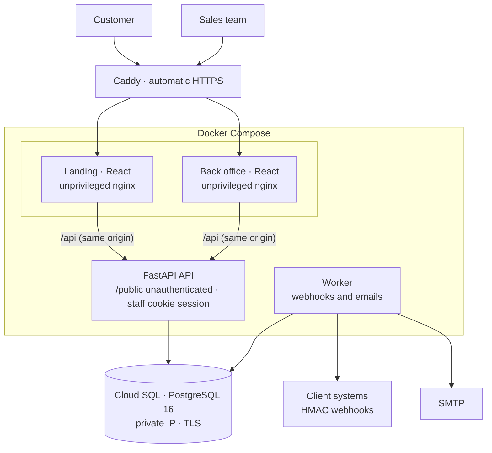
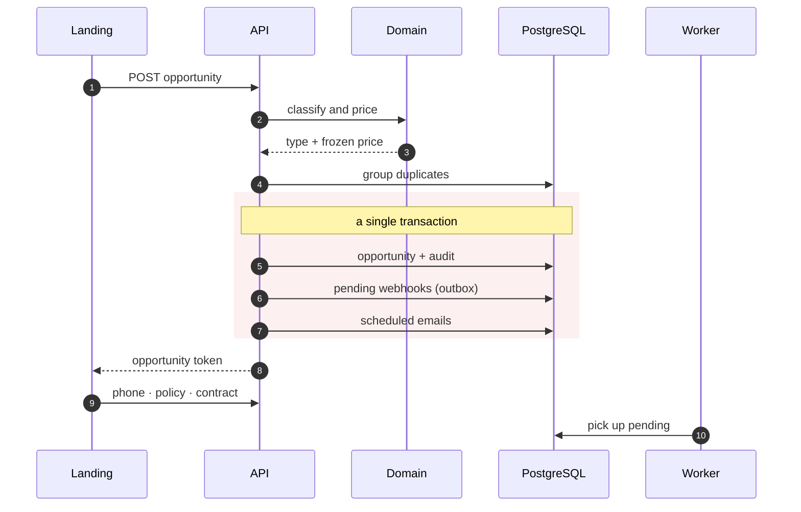
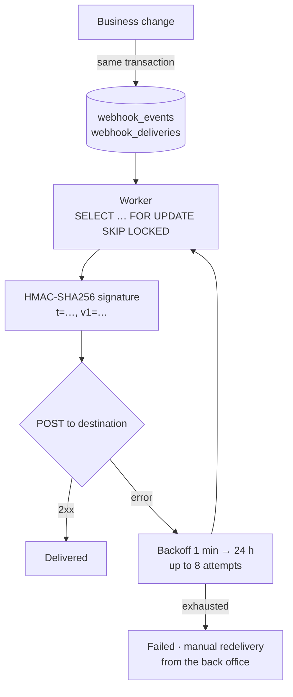
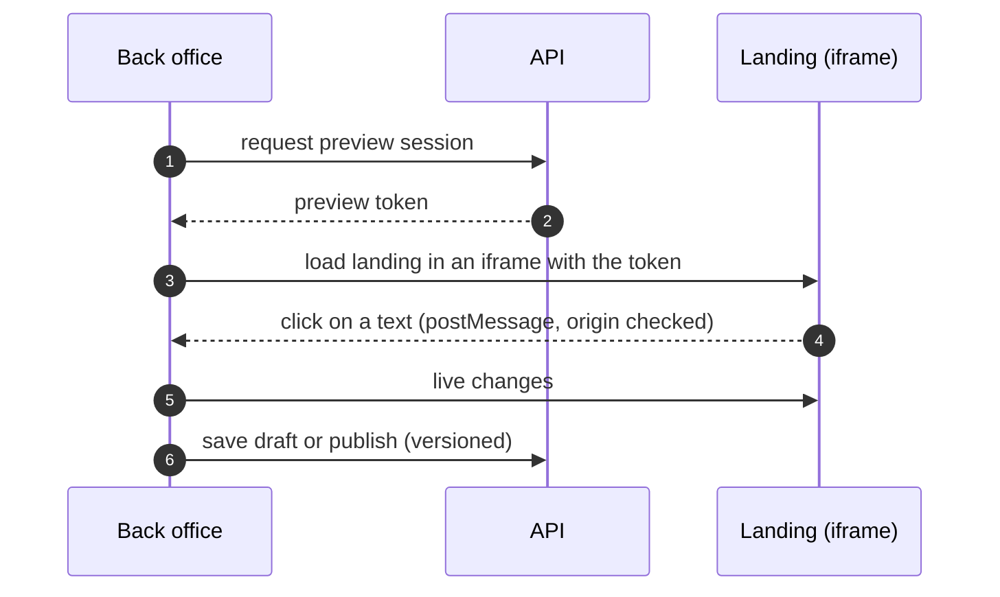

**SegurCaixa Mascotas** is the platform SegurCaixa Adeslas uses to sell its dog and cat insurance. I am building it end to end: the API, both web apps, the infrastructure and the pipelines.

- **Public sign-up landing**: a 3-step quote, a price grid for one or more pets with discount codes and promotions, free call-back requests, policy requests, a 2-step online sign-up and a vet-clinic finder with a map.
- **Back office for the sales team**: a CRM-style inbox of leads and opportunities, metrics, audit log, users with 4 roles, webhooks, a visual CMS for texts and emails, and admin for pricing and the clinic network.

Version 0.1 is already deployed to the development environment on GCP, and work continues: email automations, duplicate detection, a sales pipeline and the visual editor.

## Architecture

- **Strict one-way layers**: routes → services → repositories → models. Business rules (pricing, permissions, funnel, webhook catalogue, content schemas) live in a **pure domain layer with no I/O**, which is the single source of truth. The front ends only mirror them for display; the server is always the authority.
- **Same origin for each front end**: nginx proxies `/api`, so the session travels in an `httpOnly` `SameSite=Strict` cookie with no CORS setup.
- **Deliberately lean infrastructure** for development: one VM with Docker Compose plus Cloud SQL, no Kubernetes and no registry. Deployment builds the images, copies them to the VM and starts the services with `compose up --wait`. The API applies migrations on startup.

## From quote to contract, in one transaction

- **Frozen price.** The price is calculated and stored at quote time. Tariffs are versioned by effective date (Europe/Madrid time zone) and discounts do not stack: the larger one wins.
- **Leads only move forward.** Each opportunity is classified by type and can only advance. Duplicates by email or phone within 90 days are grouped, and the most advanced record becomes the main one.
- **Idempotent public POSTs** with an `Idempotency-Key`, so a double click or a network retry never creates two opportunities.

## Webhooks with a transactional outbox

The client's systems receive **17 event types**. So that a network failure never loses or duplicates a business event, I use the **transactional outbox** pattern:

- The event is written **in the same transaction** as the change that triggers it. If the transaction fails, the event does not exist; if it commits, the event will be delivered sooner or later.
- `FOR UPDATE SKIP LOCKED` allows several workers without double deliveries.
- Each destination has its own authentication (bearer, custom header or basic) on top of the signature. Destination URLs go through **SSRF protection**, and secrets and payloads are stored encrypted with Fernet.
- Webhook documentation is generated from the **same builders** that produce real deliveries, and each event can be test-sent from the back office.

**Automated emails** follow the same pattern: the event creates the scheduled message and, when it is due, the worker re-checks the condition, consent, the suppression list and freshness (anything older than 48 h is dropped). Every marketing email carries a signed unsubscribe link and a `List-Unsubscribe` header.

## Visual CMS without deployments

The sales team edits landing and email texts **on the page itself**, without touching code:

- Every editable text carries **invisible zero-width markers** that identify its field, so the HTML does not have to be instrumented by hand.
- Content uses a **safe custom markup** (bold, italic, underline, brand colours and internal links), never free HTML. In emails it is converted to inline styles.
- The CSP `frame-ancestors` and `frame-src` rules only allow these two apps to frame each other.

## Security and privacy

- **Session**: JWT with a `jti` in an `httpOnly` cookie, double-submit CSRF, argon2 passwords, lockout after 5 failed attempts, a revoked-token list and session invalidation on password change.
- **Sensitive data** (ID documents, IBAN) is **encrypted** in the database. CSV and Excel exports neutralize formula injection, public forms have a *honeypot*, and every response carries security headers.
- The API **refuses to start** in staging or production if it detects development secrets.
- **Privacy-first in-house analytics**: nothing is sent before consent, the backend drops personal data, and each session is linked to its lead to show its path through the 10 funnel steps. Google Ads, Meta and GA4 tags load only with marketing consent.
- **GDPR**: a retention command anonymizes old leads and purges old analytics.

## Quality

- **Backend**: 145 tests against a real PostgreSQL, **94% branch coverage** with a mandatory 90% floor; `mypy --strict`, Ruff with security rules, `pip-audit` and `detect-secrets`.
- **Front ends**: more than 180 tests with Vitest, Testing Library and MSW, plus **26 Playwright e2e tests** on desktop and mobile, including the password-reset flow through a test mailbox.
- **CI on Bitbucket Pipelines** with parallel quality, security and test steps, and hooks that enforce Conventional Commits, block secrets and prevent direct commits to `main`.
- A local load test sustained about 160 requests/s with no errors and a p95 under 0.8 s with 50 concurrent users.
