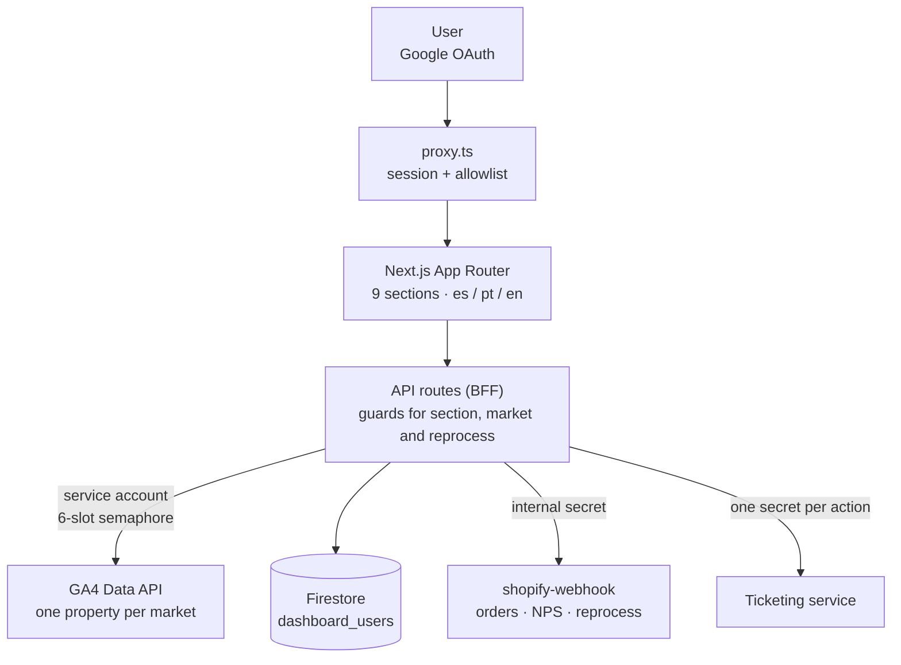
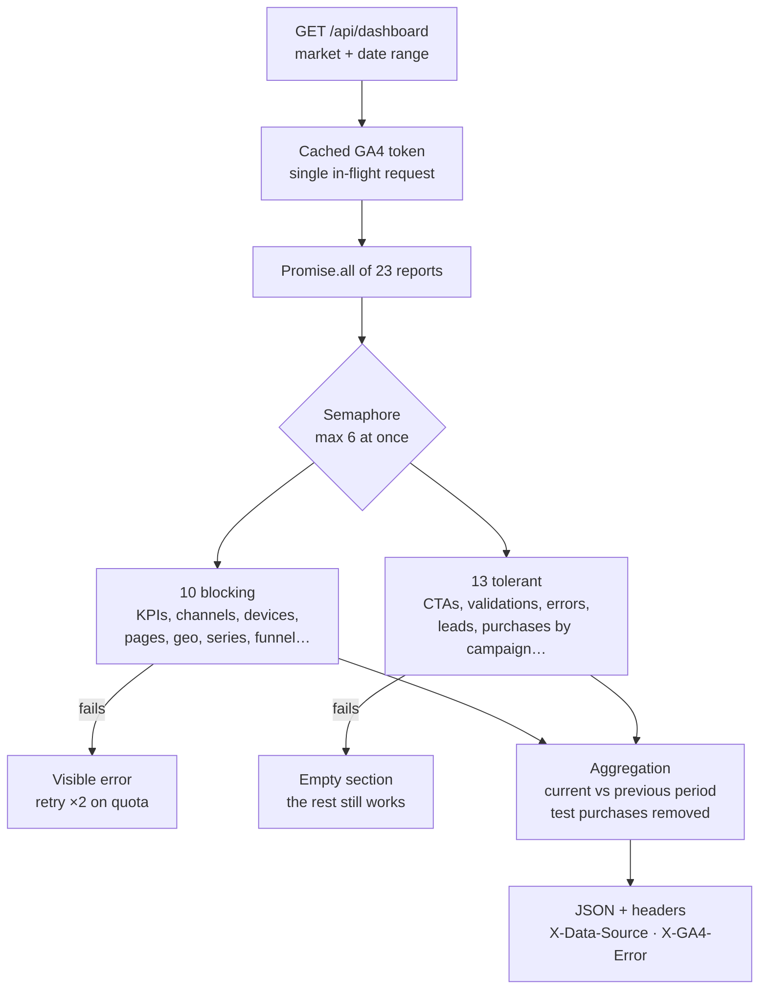
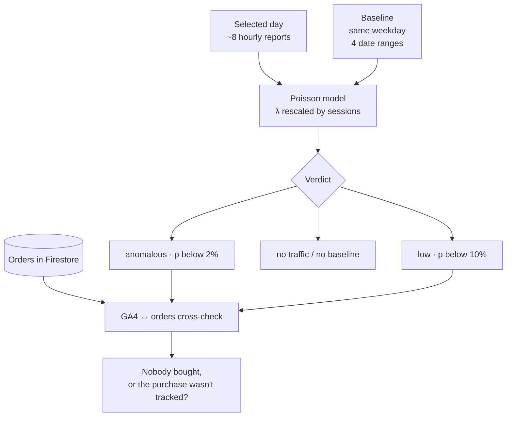

Culligan's marketing team did not trust GA4's numbers: funnel attribution got lost, and nobody could quickly answer questions like *"we had 0 purchases today — why?"*. I built an **internal dashboard** that brings traffic, conversion, funnel, orders, NPS and support into one place, with audited numbers split by market (Spain, Portugal and a comparison view).

It is used by business and marketing staff, analysts and admins, each with different permissions.

## Architecture

- **Backend-for-frontend.** The browser never talks to GA4, Firestore or the microservices: everything goes through API routes that check permissions and keep secrets hidden.
- **GA4 via a service account**, separate from user identity. Users need no Google Analytics permissions, and the door is open to scheduled alerts.
- **Multi-market configuration** through `NAME_ES` / `NAME_PT` variables. Portugal does not inherit Spain's configuration by default: if a variable is missing, the market shows as disabled instead of displaying another country's data.

## Loading the dashboard: 23 reports in parallel without blowing the quota

- GA4 allows 10 concurrent requests per property. A **process-wide semaphore** caps real concurrency at 6, and the access token is cached with a single in-flight request, so one load never mints 22+ tokens.
- Reports are split into **blocking** ones, without which the view makes no sense, and **tolerant** ones that return empty on failure. A real bug taught us not to hide quota errors as empty sections: they are now retried with backoff and surfaced.
- **Never fake data.** Without credentials the API returns zeros plus headers that trigger UI banners, so nobody mistakes a demo for reality.

## Funnel rebuilt from URLs

The subscription funnel has 11 steps. I rebuild it from URL parameters (`?cta=&step=&flow=&product=`), with custom events as a fallback. To keep the funnel honest:

- Drop-off is measured against the **declared total and the next step with traffic**, never against the previous step.
- Mid-funnel entries are shown separately as *"+N enter here"* instead of producing negative drop-off.
- A dedicated report crosses purchases with campaigns per product, because the payment redirect lost session attribution.

## Daily anomaly diagnosis

The dashboard compares the day with previous same weekdays, adjusts the expectation to actual traffic with a **Poisson** model and cross-checks GA4 purchases against real Firestore orders. That separates *"nobody bought"* from *"they bought, but tracking failed"*. Days are bucketed in Madrid time.

## Three-layer permissions

- **Identity** through Google OAuth (only `openid email profile`) and **authorization** through a Firestore allowlist. Permissions are stored expanded on three axes (sections, markets and `canReprocess`), with *admin*, *analyst* and *viewer* role templates, and the JWT re-reads them every 5 minutes.
- **Middleware** that blocks access without a session, **per-route server guards** (the layer that actually protects) and an isomorphic, *fail-closed* function that only decides what the UI draws.
- **Admin safety rules**: nobody can edit or delete themselves, there is always at least one active admin, and bootstrap admins act as a safety net.

## Numbers you can trust

I built a **metric audit** that judges every figure (impossible, contradictory, zero with a non-zero denominator) against live data and fixtures. Over 5 runs it reached 0 failures and surfaced two real problems:

- a metric read by position was showing *sessions per user* as *pages per session*; metrics are now read by header name;
- Portuguese traffic contaminated Spain's GA4 property for a week.

The **Compare** view uses rates, percentage-point deltas and series rebased to 100, and sends one request per market so one can fail without affecting the other.

## Deployment

A multi-stage Docker image that runs as non-root, with **Cloud Build → Artifact Registry → Cloud Run** and secrets injected from Secret Manager. The service is network-public on purpose, because the app does its own authentication.
