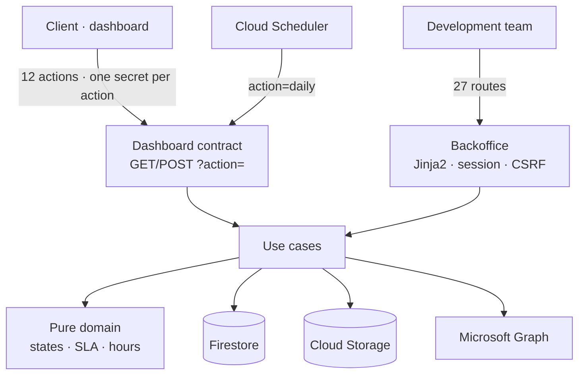
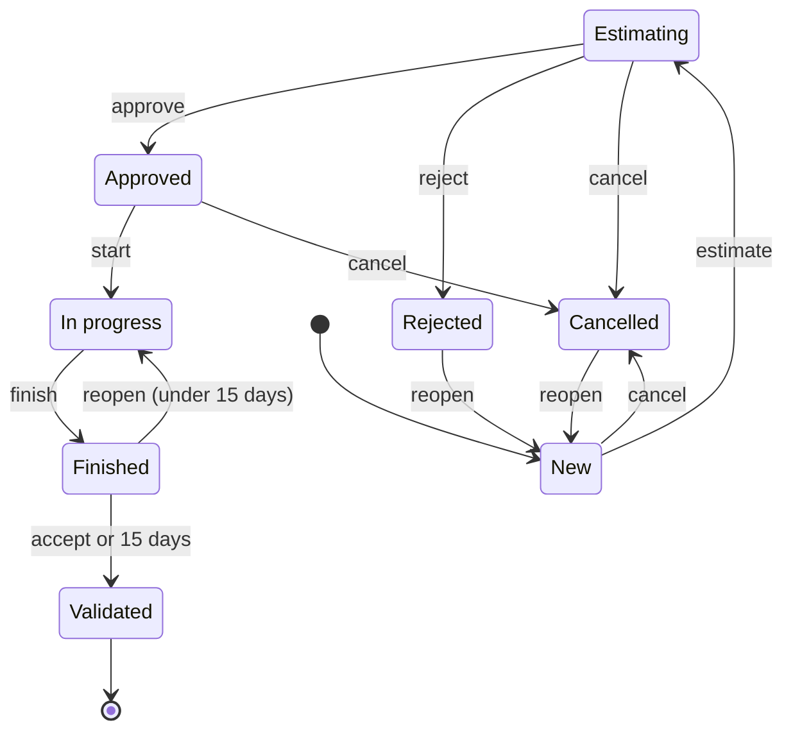
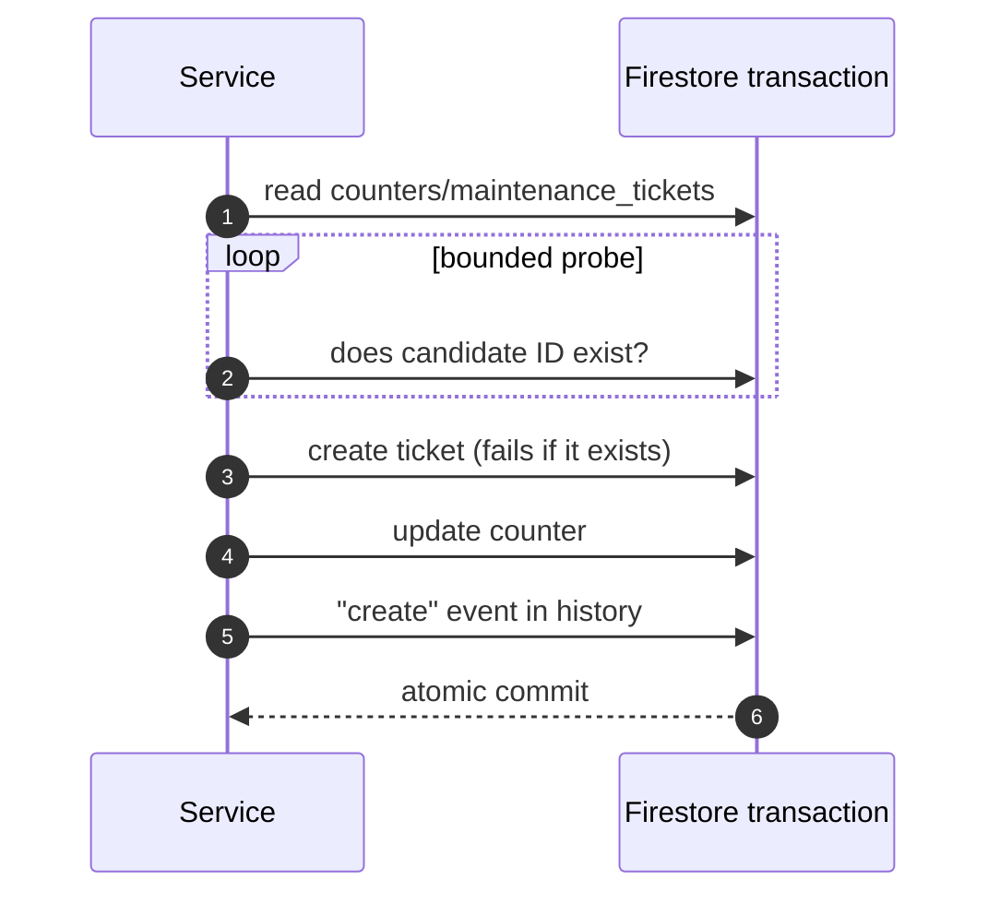

Maintenance tickets between Culligan and the development team lived in a **Power Automate flow, an Excel sheet and Teams cards**. The sheet's ID counter stopped advancing, and one day a new ticket received an existing ticket's ID and **overwrote it**. I rewrote the system as a **dedicated FastAPI service** with two faces: the dashboard's *Maintenance* section for the client, and a back office for the team.

## Architecture

- **Inward-pointing layers**: the domain is pure logic (states, transitions, SLA, hours bank), and repositories, storage and the notifier are injected from a container.
- **I kept the dashboard contract unchanged**, so the rewrite required no client changes.
- **A different secret per action**: a leaked read secret cannot create or approve tickets. The client view is filtered server-side, so internal notes, storage paths and field history never leave the service.

## Ticket lifecycle

- Any undeclared transition returns **409**. Cancelling and reopening require a reason.
- If the client changes the scope after the estimate, the ticket goes back to *New*. Once approved, only the priority can change.
- **Calendar-hour SLAs** while the ticket waits on the team: high priority 24 h, medium 72 h, low 120 h. An unanswered client message puts the ball back in the team's court.

## IDs that never repeat

The original bug was a counter that did not advance. Now ID allocation and ticket creation happen in **a single Firestore transaction**:

- `create` **refuses to overwrite** an existing document, even if the counter were wrong.
- Every status change goes through a single method that, in the same transaction, checks the current status, applies the change and writes an event with before and after values. The history is **append-only**.
- An **idempotent migration**, *dry-run* by default, restored the overwritten ticket, renumbered the affected ones and left audit events for the import. A regression test guarantees IDs never repeat.

## Hours bank, reports and daily job

- **Hours bank per category** (development, architecture, PO). Top-ups are append-only (a correction is a negative top-up) and the balance is top-ups minus logged hours. Time entries are per person, category and day, and are voided instead of deleted.
- **Monthly report** as JSON, CSV or a printable page, with opening balance, top-ups, consumption and closing balance.
- **Idempotent daily job on Cloud Scheduler**: it auto-validates tickets finished 15 or more days ago and sends the team a digest of tickets out of SLA.
- **Attachments** in a private bucket: filtered by extension and *magic bytes*, up to 10 MB per file and 5 per message, and served only through the service.
- **Email through Microsoft Graph**, because Exchange Online retired SMTP basic auth. An email failure never makes the action fail.

## Hard bugs I fixed

- **Vanishing sessions.** When the system clock stepped back after an NTP adjustment, signed cookies were considered invalid and Starlette silently dropped the session. I fixed it with a signer based on a monotonic clock.
- **Fields wiped on sync.** A *merge* write carrying empty fields erased ticket data. Now incoming empty values never overwrite a stored value.

## Quality and deployment

- **180 offline tests** with an in-memory Firestore double that reproduces transactions and `create` semantics. Branch coverage is **98%**, with a 95% floor on every run.
- **Bitbucket Pipelines** with isort, Black, Ruff and pytest.
- A `deploy.sh` that refuses to deploy a dirty tree or failing tests, boots the container and checks `/healthz`, warns about missing required variables and **never overwrites environment variables**, so a deploy cannot blank a secret.
