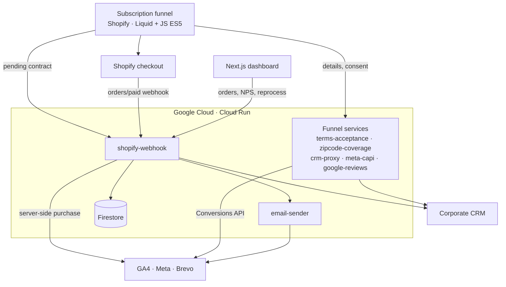
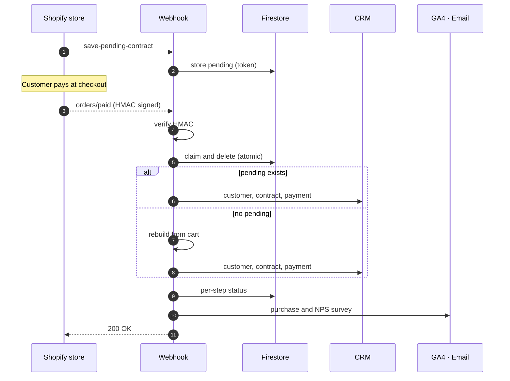
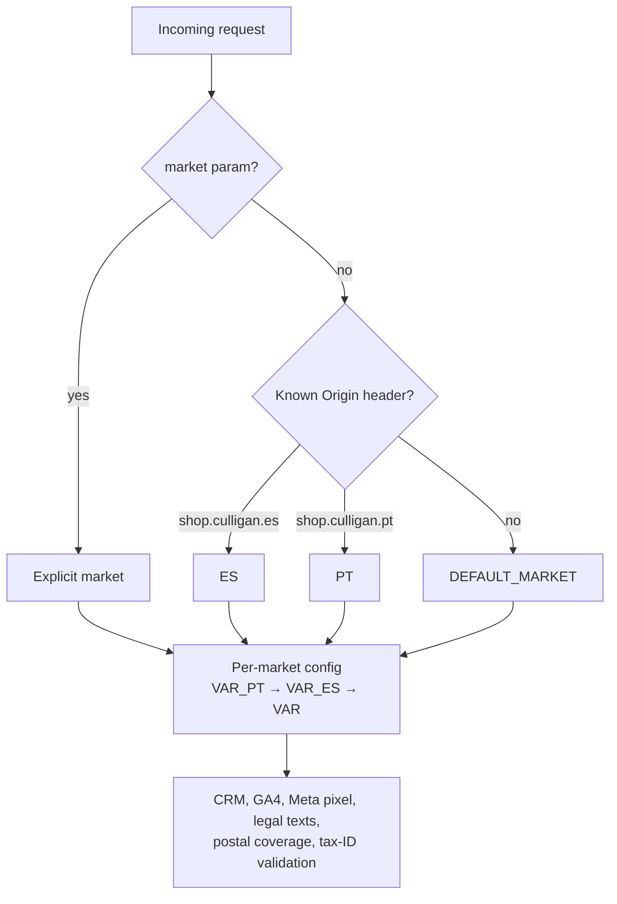
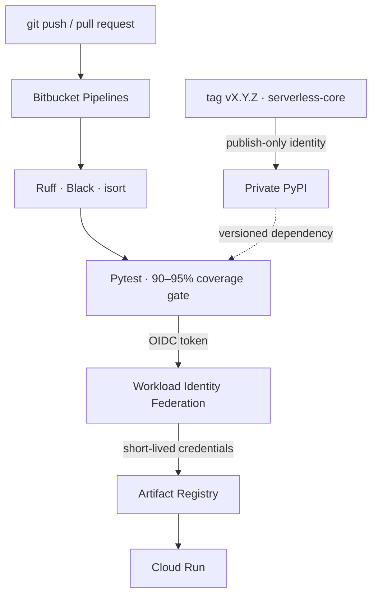

Culligan sells water dispensers online as a subscription: the device plus periodic refills. The goal was for **a complete sale to happen with no human involvement**, from the moment a customer picks a plan until the contract is registered in the corporate CRM with its first payment recorded.

I was the technical lead and main developer: the storefront funnel, the microservices, the dashboard, the infrastructure and the technical documentation handed over to the client.

## Architecture

The system has four parts: a **Shopify store** with a custom subscription funnel, **8 serverless microservices on Google Cloud**, a **private dashboard** for analytics and operations, and the **external systems** (CRM, payments, email and measurement).

Each service is small and has a single responsibility. They all share a **versioned internal library** (`serverless-core`) that handles the cross-cutting concerns: declarative routing, a uniform error envelope, authentication policies, CORS, logging without personal data and the CRM client.

## The order webhook: contracts only after payment

The most important architecture decision was to **move contract creation to the payment webhook**. In the first version the contract was created from the browser before payment, which produced "ghost" contracts whenever a customer abandoned the checkout.

Now the funnel only stores a **pending contract** in Firestore, keyed by an unguessable token that travels in hidden cart properties. Shopify confirms payment with the `orders/paid` webhook, and the backend completes the whole onboarding:

What makes this flow robust:

- **Fail-closed authentication.** The webhook endpoint requires Shopify's HMAC signature computed over the raw body. If the secret is missing from the configuration, it rejects the request instead of letting it through.
- **Atomic de-duplication.** Shopify guarantees *at-least-once* delivery: it retries up to 19 times over 48 h and can deliver the same event twice almost simultaneously. The pending contract is claimed and deleted inside a Firestore transaction, so only one delivery can create the contract.
- **Rebuild.** When there is no pending contract (orders from landing pages, lost data), the contract is rebuilt from hidden cart properties and a price → template table. Each of the four possible scenarios (`happy`, `landing_gap`, `funnel_gap`, `true_gap`) raises a distinct Sentry alert.
- **Per-step status and idempotency.** `processed_orders` records the contract, payment, GA4 and NPS separately. The dashboard's **"Reprocess"** button retries only the failed steps, never duplicates analytics, and is the only manual action allowed to write to the CRM.
- **An unfriendly CRM.** The CRM returns HTTP 200 even on errors and is not idempotent when creating contracts. So calls use explicit timeouts, an `Idempotency-Key` header, and TLS verification with a custom CA bundle instead of turning verification off.

## One codebase, two markets

The expansion to **Portugal** was designed as multi-market in code, not as a copy of the project:

- The **Portugal theme** was cloned from Spain's and translated to European Portuguese. UI strings were centralized in a dictionary so they could be translated.
- I built a **catalog migration tool** (products, collections and metafields) on the **Shopify Admin GraphQL API**. It is idempotent, runs *dry-run* first, paginates past the 250-node limit and is non-destructive by design: a test guarantees it contains no delete mutation.
- While Spain could not yet deploy the multi-market version, Portugal ran on a **temporary cluster of 8 `-pt` services**. Both markets share Firestore and every order is tagged with its market. The documented plan is to merge the services back.

## Keyless CI/CD and quality

- **No stored service-account keys.** CI authenticates to GCP with Bitbucket OIDC tokens and Workload Identity Federation. One read-only identity serves every repository, and a separate publishing identity is bound only to the library repository. That closes the door to supply-chain tampering.
- **Mandatory coverage gates** of 90–95% in every service, with **more than 1,100 tests**. None of them touch the real network or database: adapters are injected.
- **A `deploy.sh` per service**: it requires a clean git tree, runs the tests, builds the image, smoke-tests the container before deploying, and supports a `--market pt` mode.
- **A security audit** shaped the library's design. Authentication policies are declarative and *fail-closed* by default (public, browser origin, shared secret with constant-time comparison, Shopify HMAC), and errors never expose internal details.

## Server-side measurement and in-app browsers

- The purchase is sent to **GA4 via the Measurement Protocol** from the backend, carrying the browser's `client_id` and `session_id` so attribution is not lost. **Meta Conversions API** events are de-duplicated against the browser pixel with a shared `event_id`, and personal data is sent hashed.
- A large share of traffic comes from the **Instagram and Facebook in-app browsers** and from Samsung Internet. That is why the funnel is written in **ES5** (no `async/await` or `?.`). Using **Sentry Session Replay** I diagnosed and fixed a rendering freeze that only happened in those browsers. The pay button fires parallel calls with strict timeouts and a *warm-up* call that avoids 2–3 s cold starts.

## Operations dashboard and tickets

Two parts of the ecosystem have their own case study:

- **[Culligan Analytics](../culligan-dashboard/)**: a Next.js dashboard that loads 23 GA4 reports in parallel, rebuilds the funnel, diagnoses daily anomalies with a Poisson model and reprocesses orders in one click.
- **[Culligan Tickets](../culligan-tickets/)**: the FastAPI service that replaced Power Automate and Excel, with a state machine, transactional IDs, SLAs and an hours bank.

## Outcomes

- Online sales run **end to end with no manual intervention**, and contracts are no longer created without payment.
- There is **full visibility** into every order, with one-click recovery when an external system fails.
- The second country launched **without duplicating the codebase**.
- The 8 microservices share an audited common foundation, with secretless CI/CD and more than 1,100 tests.
- I delivered a **technical manual** of about 1,300 lines with 12 diagrams generated from code.
