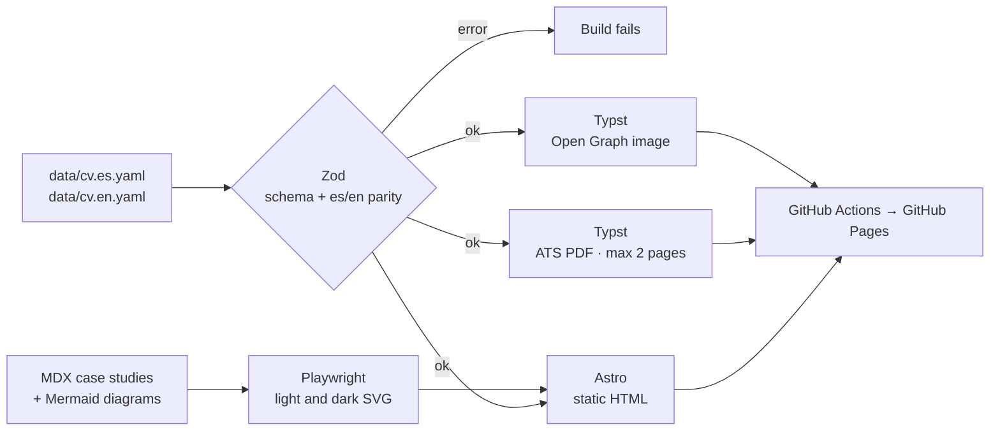

My resume is not edited in a word processor: it is **compiled**. The data lives in a single YAML file per language, and everything else is generated from it: this website, the PDF for ATS systems, the social preview image and the search-engine metadata. The code is public at [github.com/inehosa1/cv](https://github.com/inehosa1/cv).

## Decisions

- **Typst for the PDF.** It reads the YAML directly, compiles in milliseconds and produces real text with embedded fonts in a single column, so ATS systems parse it without errors. The build fails if the resume exceeds two pages.
- **Astro with no client-side JavaScript.** It generates static, semantic HTML with dark mode via `prefers-color-scheme`, WCAG AA contrast, `Person` JSON-LD and `hreflang`.
- **Diagrams as code.** The diagrams in these case studies are written in Mermaid and rendered at build time with Playwright into SVG, in a light and a dark variant. No library is loaded in the browser.
- **Strict validation.** The schema rejects unknown fields and checks that the Spanish and English versions have exactly the same structure.
- **Privacy.** The phone number is never included in the structured data for search engines.
