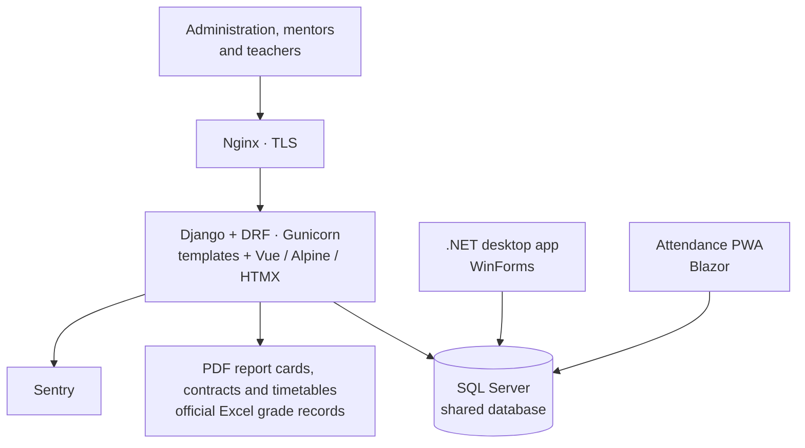
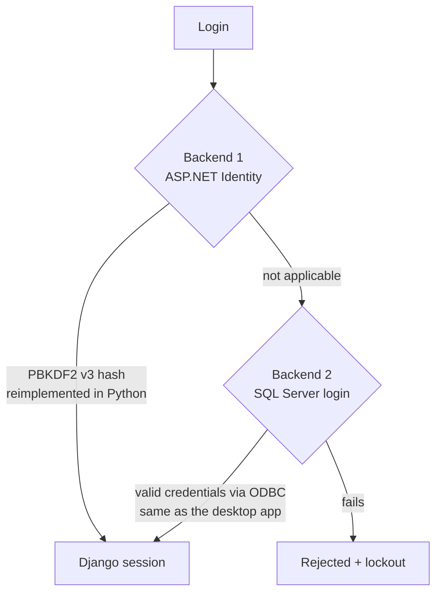
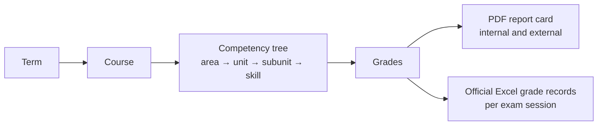

An international school with students from first to twelfth grade, and subjects from both the US and Spanish curricula, ran its academic life on several **.NET** apps: a WinForms desktop app for administration and a Blazor PWA for teachers to take attendance. I was tasked with building a **new Django web system** to gradually replace them, with a hard constraint: **the old apps are still in use and share the same SQL Server database**.

I did practically all of the development (163 of 164 commits). The system is in production.

## Architecture

- **Coexistence, not a big-bang replacement.** Django reads and writes the same tables as the .NET apps. Of its 57 models, **16 are `managed=False`** and map onto the existing schema, with computed columns and non-auto-increment primary keys.
- **Domains**: security (ASP.NET Identity tables), users (students, teachers), academics (terms, courses, competency tree, grades) and organization (timetables, rooms, enrollments, attendance, events).
- **Roles**: administration, mentor (read-only), teacher (own timetable) and timetable editor, with write permissions enforced endpoint by endpoint.

## Login compatible with the .NET system

Users could not have two passwords. I implemented two authentication backends:

- I reimplemented **ASP.NET Core Identity V3** (PBKDF2) hash verification in Python, with lookup by username or email and a lockout check.
- I found and fixed a format error in the hash's PRF field (1 byte instead of 4), so passwords reset from Django keep working in the .NET PWA, and re-hashed the affected accounts.

## From competency tree to report card

- **Competency tree editor** per course, with categories and subcategories. Targets are copied automatically when a new term is created.
- **I ported report card, contract and student/teacher timetable generation from C#/iTextSharp to Python (ReportLab)**, with canvas-level pagination, repeated headers and sections that never split across pages, so the new documents are **identical to the ones the school already knew**.
- **Official grade records** in Excel in the required format: Spanish subjects only or all subjects, per exam session. Batch commands generate complete sets per grade.
- **Attendance**: per-lesson records, a school event log and an absence-justification inbox filtered by grade and term.

## Hard production problems

- **From 193 s to 1.6 s.** The student page fired hundreds of per-row `COUNT`s (N+1). I replaced them with a correlated-subquery annotation.
- **Always the wrong record.** The locale's thousands separator turned ID `1028` into `1,028` inside the template's JavaScript, so any record with an ID of 1000 or more showed another record's data.
- **Invisible courses.** Legacy `NULL` values in the archive flag hid almost every course. I backfilled the data and made every filter *NULL-safe*.
- **Writing to someone else's schema.** A *mixin* excludes SQL Server computed columns from `UPDATE`s and generates IDs where the table is not auto-increment.
- **Deleting without destroying.** Courses with enrollments are archived instead of deleted, and I added SQL Server performance indexes.
- **Safe data repairs**: every bulk fix (enrollments, school years) runs after a JSON backup.

## Quality and deployment

- **177 tests** with a custom *test runner* that creates the Django-unmanaged tables in SQLite, so tests run without the real SQL Server.
- Docker with Nginx and TLS, Gunicorn and a database-backed healthcheck, deployed on **AWS EC2**, with Sentry for errors.
- I maintain my own technical audit of known debt and its priority.
- I also improved the .NET attendance PWA: navigation to past days with admin-only editing, per-course stats and an attendance cache.
