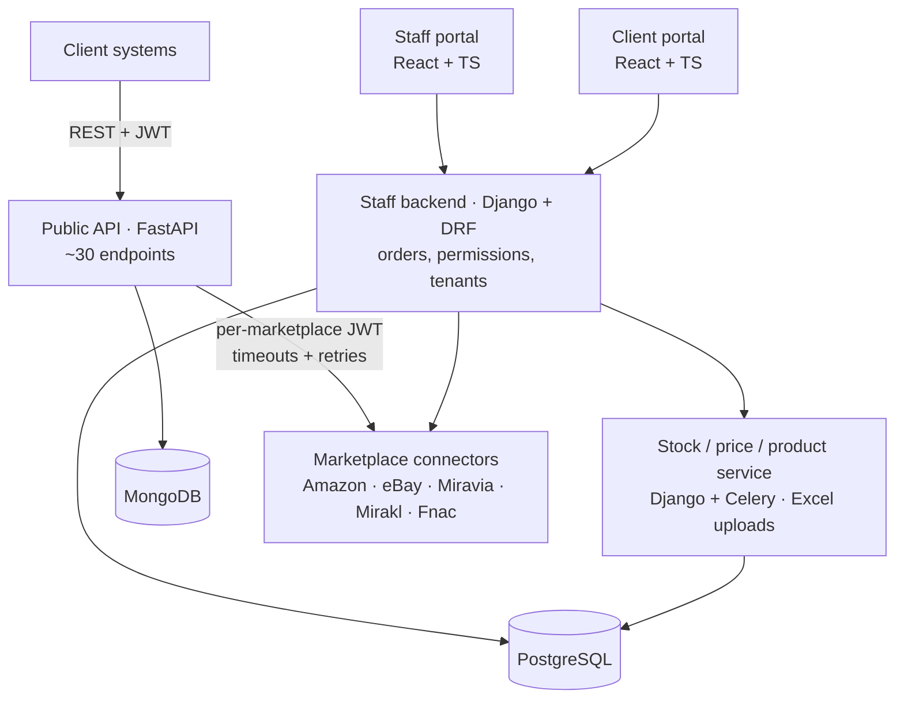
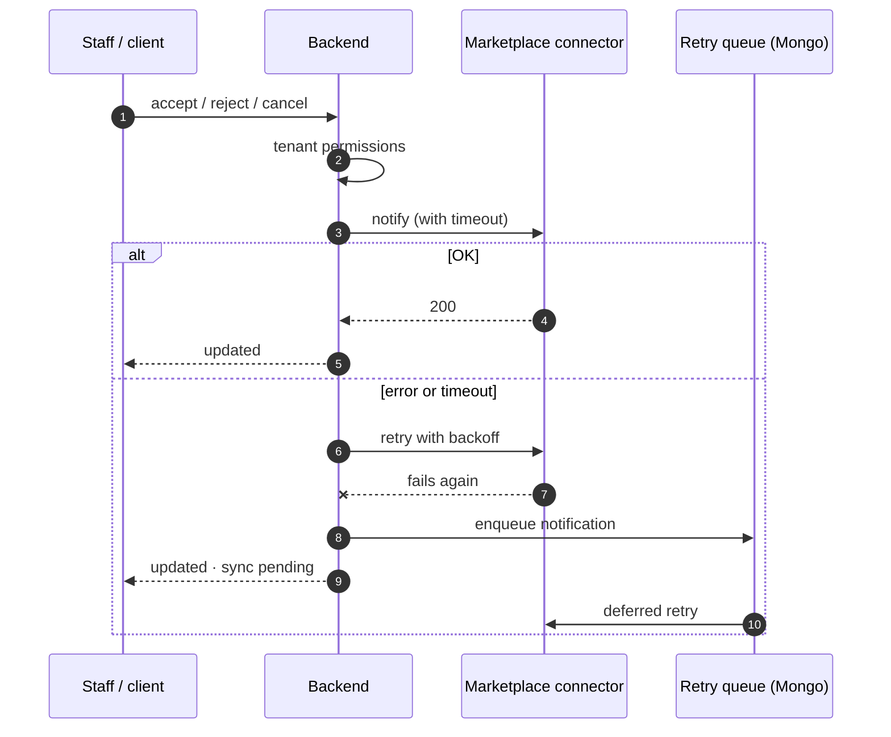
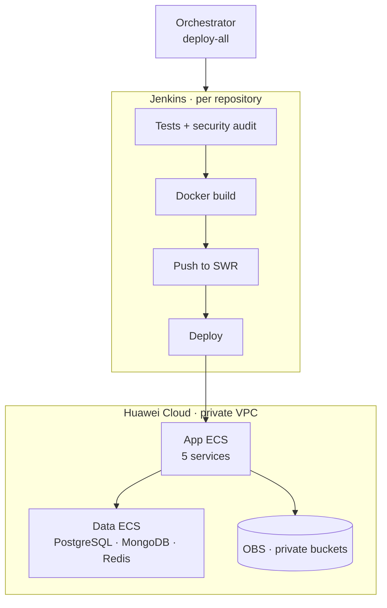

**SEB Markets** lets retailers manage products, stock, prices, offers and orders across several marketplaces from one place. It is multi-tenant (client → stores → marketplace and country), has one portal for SEB staff and another for clients, and exposes a **public API** so clients' systems can integrate directly.

I worked on it in two phases:

- **2024**: OpenAPI documentation and API schemas, the product validation library (`market-lib`) and eBay integration fixtures.
- **2026**: a workspace-wide **security, testing, resilience and modernization** pass, and the platform's migration to Huawei Cloud.

## Architecture

## Hardening the public API (OWASP Top 10)

The public API is the most exposed surface in the system. I reviewed it against the **OWASP Top 10** and hardened it layer by layer:

- **Authentication and authorization**: a mandatory token on every business route, per-marketplace authorization and login **rate limiting** per user and per IP (429 responses).
- **Input and output**: identifiers are sanitized before being sent to connectors, file uploads are protected against *path traversal*, security headers (CSP, HSTS…) are on, and interactive docs are hidden in production.
- **Dependencies**: upgraded Python (3.10 → 3.12), FastAPI and Starlette, and replaced `python-jose` with PyJWT. Vulnerabilities reported by `pip-audit` went from **28 to 0**.
- **Observability**: structured JSON logs with a `request_id`, plus audit events.
- **Containers and pipeline**: a Docker image that runs as non-root and a security-audit stage (pip-audit and bandit) in Jenkins.

The API suite grew from 396 tests (~92%) to **506 tests with 99% coverage**. I used `respx` to mock the HTTP connectors and `mongomock-motor` for MongoDB, so no test depends on external services.

## Resilient order synchronization

Before, a slow or unavailable marketplace could leave orders out of sync without anyone noticing. I redesigned the order-line status change flow:

## Multi-tenant isolation in the Django backend

- **Rewrote permission validation**: it kept state in class attributes shared across requests and threads, a race condition that could mix permissions between users.
- Added per-HTTP-method permissions and privilege-escalation checks, rolled out gradually in **`warn` → `enforce`** mode: violations are logged first and blocked later, without breaking existing clients.
- A new **Orders API v1 contract** with upserts and filters.
- **208 new tests** in a backend that had no suite.

In the stock, price and product service I added real validation of Excel uploads and idempotent create endpoints (409/404), fixed security and tenant-isolation issues, and reached **154 tests with 89% coverage**. The container now runs migrations and gunicorn instead of the development server.

## Migration to Huawei Cloud

- VM-based deployment in a **private VPC**, with restricted security groups and a datastore separated from the apps.
- **5 new pipelines** (`Jenkinsfile.huawei`) with tests and security audit, build, push and deploy; a `deploy.sh` with partial modes, an orchestrator to deploy everything and a nightly shutdown script to cut costs.
- Storage moved from GCS to **OBS** with private buckets.
- I evaluated **FunctionGraph** (serverless) and discarded it because of the account's IAM limitations. The decision is documented.
- I validated the migration end to end on a sandbox Jenkins, and the validation surfaced real configuration bugs (MongoDB authentication, CORS origins).

## AI-native workspace

I set up the 10-repository workspace to work with **Claude Code** safely and repeatably:

- **8 specialized subagents**: repo mapping, contract auditing, security auditing, running and writing tests, changelog, connector reading and per-repo work.
- **Skills** for repetitive tasks (`new-endpoint`, `new-page`, `sync-product-schema`) and **hooks** that format Python and validate JSON after every edit.
- **Rules that block reading secrets**, and an `AGENTS.md`/`CLAUDE.md` in every repository with contracts and conventions.
