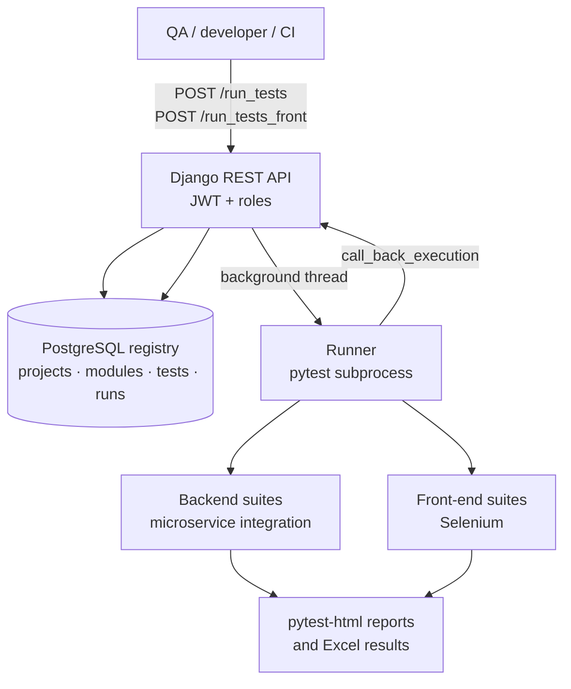
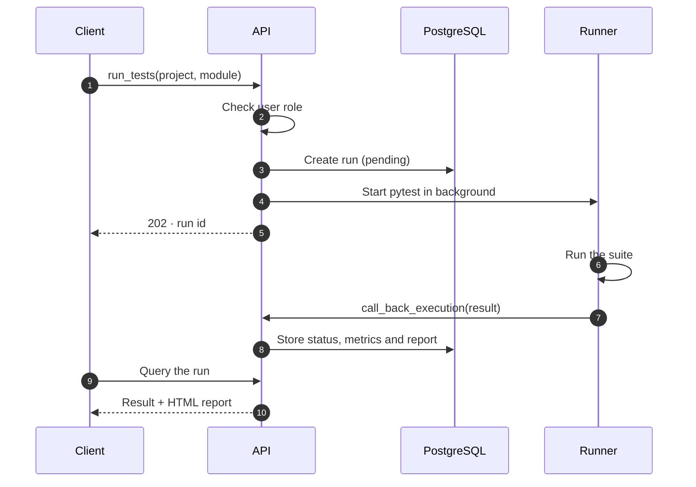

As **SEB One** grew, so did its microservices: alerts, dashboards, email, order imports, uploads of payment and settlement files, and payment orchestration with **Hyperswitch**, **Stripe** and **Adyen**. Testing every release by hand no longer scaled. I created **SebPay Connect**, a platform that turns test suites into a service anyone on the team can trigger through an API.

## How it works

## Technical decisions

- **Tests registered in the database.** Projects, modules, tests, functions and runs are queryable entities, so result history is auditable and comparable across releases.
- **Asynchronous execution with callbacks.** The API responds immediately and the runner reports back through a callback, so long Selenium suites never block whoever triggered them.
- **Role-based execution.** Each user can only trigger the suites for their own projects.
- **Front-end suites split into their own repositories**, one for the staff portal and one for the client portal, with 63 test files.
- **Payment-integration coverage**: dedicated suites for the Hyperswitch, Stripe and Adyen flows, and for uploads of order, payment, settlement, tax and transaction files.
