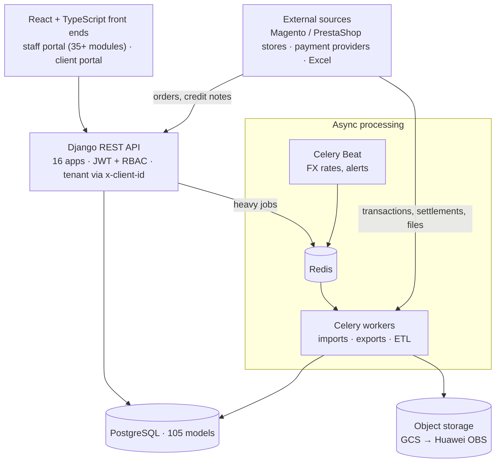
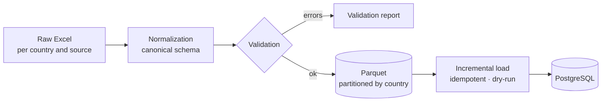
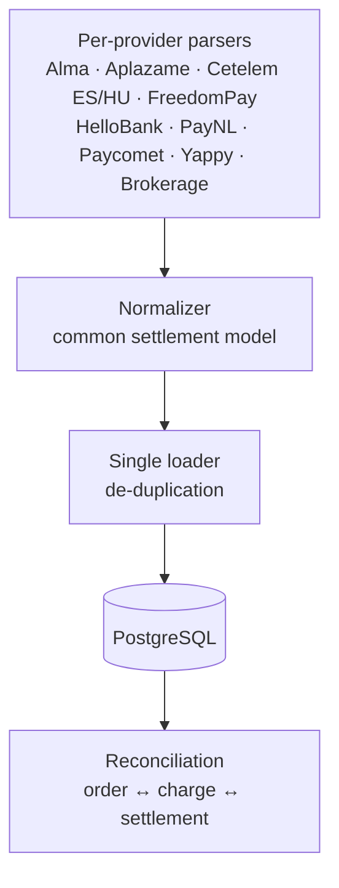
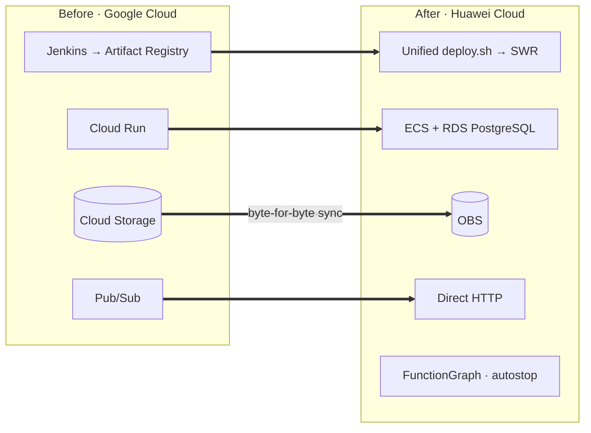

**SEB One** is the back office SEB Business uses to run e-commerce for brands in **Spain, France, the Netherlands, Portugal, Hungary, the Czech Republic and Panama**. It reconciles orders from several stores with charges from many payment providers, issues invoices and credit notes, calculates commissions, and handles refunds and disputes.

I worked on it for about 20 months as the **top backend contributor** (974 of ~1,450 commits). I also built parts of both front ends (staff and clients), the deployment tooling and the cloud migration.

## Architecture

- **Per-request multi-tenancy.** Every request carries the active client in the `x-client-id` header, and the permission layer (RBAC with roles and per-module permissions) scopes every query to the tenant.
- **Everything heavy is asynchronous.** Bulk imports and exports, recalculations and document sending run on **Celery** with Redis. Users get the result as a notification, without blocking the API.
- **Documented API** with drf-spectacular (OpenAPI): 89 registered viewsets, 89 custom actions and 66 management commands for operations and data.

## Financial domain

I implemented a large part of the core business logic:

- **Invoicing**: full and partial invoices and credit notes, with discounts and tax breakdown. It includes reconciliation of unmatched credit notes, import of received invoices and sending documents by email with their attachments.
- **Commission engine**, configurable by gateway, country, payment method, card type, number of installments and validity period.
- **Refunds and disputes**: approve, reject, issue and notify actions; cancellation reasons; IBAN/SWIFT validation for bank-transfer refunds; bulk import from the client's real Excel template, with a preview.
- **Statistics and dashboards** with caching, a change **audit log**, and daily FX conversion to EUR via Celery Beat.

## ETL: from Excel to a queryable data warehouse

Historical data arrived as heterogeneous Excel files per country. I designed a staged pipeline that can be reproduced in any environment with a single command:

- **Parquet as the canonical intermediate format**: it is typed, columnar and partitioned by country, so each stage can be re-run in isolation.
- **Incremental, idempotent loads** with a *dry-run* mode and validation reports before the database is touched.
- Result: about **590,000 received-invoice lines** from 7 countries, over 37,000 credit notes and hundreds of thousands of historical Magento and PrestaShop orders, loaded and queryable.

## Settlement engine for payment providers

Every provider delivers settlements in its own format. I built a **spec-driven** engine: one parser per provider produces a common normalized model, and a single loader persists it.

Adding a new provider only takes its parser and spec: normalization, loading and reconciliation are reused.

## Database performance

The order, payment and transaction tables grow quickly. I designed **composite B-tree indexes** for the most frequent filters, **BRIN** indexes for time columns on large tables, and a documented **monthly partitioning plan**.

## Migration from GCP to Huawei Cloud

In 2026 I led the technical side of moving the platform from **Google Cloud to Huawei Cloud**:

- A **switchable storage layer** (GCS ↔ OBS) with signed URLs, so the migration did not require rewriting data. In STG, 644 objects (2.97 GB) were migrated with byte-for-byte parity checks.
- **A single `deploy.sh`** to build, publish and deploy the 4 applications (backend, two front ends and the transaction-recovery service) to STG or PRO. Images are tagged `<git-sha>-<timestamp>` and there is a `--check` preflight.
- **A FunctionGraph function** that shuts down idle machines based on CPU and network thresholds, with a *dry-run* mode and SMN alerts, to cut costs.
- The transaction-recovery service was decoupled from Pub/Sub and the Google SDK so it could run on ECS and RDS.

## Quality and ways of working

- **~1,500 backend tests** with pytest, factory_boy and freezegun, **88% coverage** and a mandatory floor in pre-commit. *Given/When/Then* test catalogs are generated automatically as documentation.
- **Jenkins** pipelines to Cloud Run, with manual approval for staging and a `/health` smoke test.
- **AI-native development**: more than 100 commits co-authored with **Claude Code** across the repositories, each with a `CLAUDE.md` and agent configuration. I also used about 80 **OpenAI Codex** agent branches in a sandbox to expand test coverage and build the statistics module.
- On the front end I built the refund and dispute UIs, a drag-and-drop export field picker, the credit-note timeline, global search by provider reference and the English localization. I also removed every explicit `any` and all ESLint errors.
