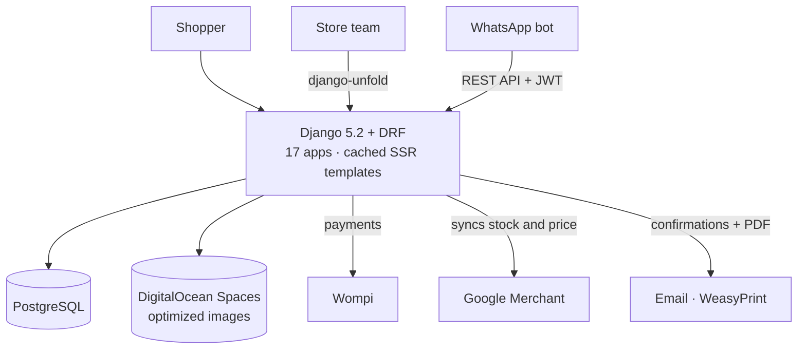
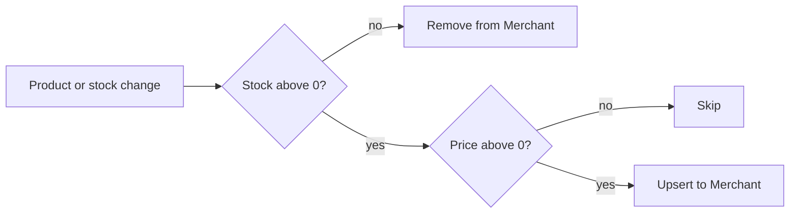
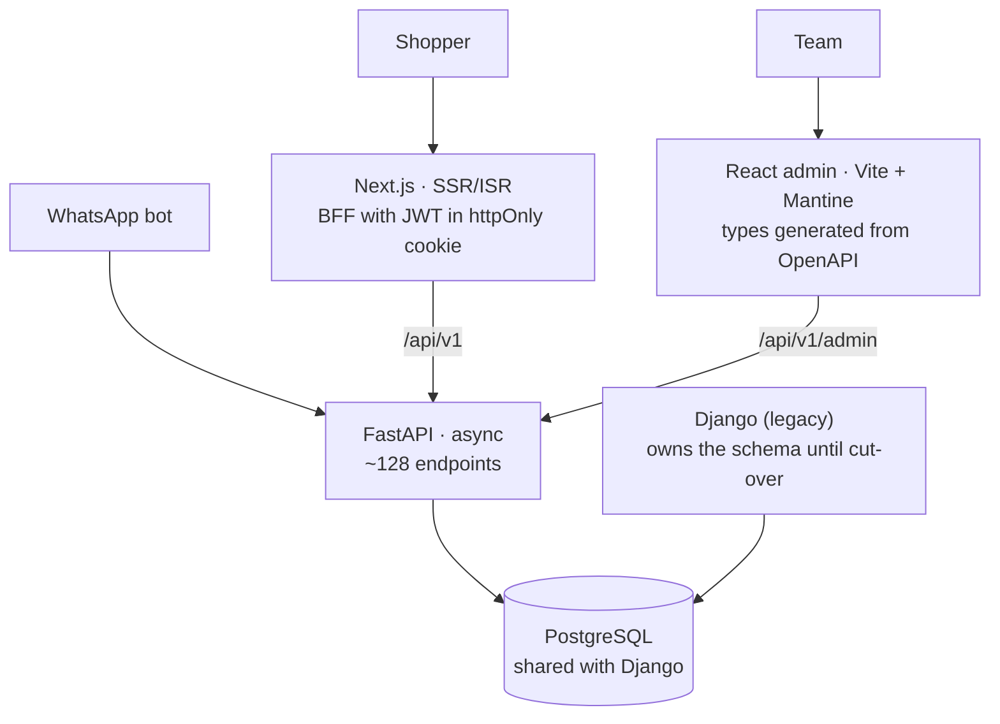
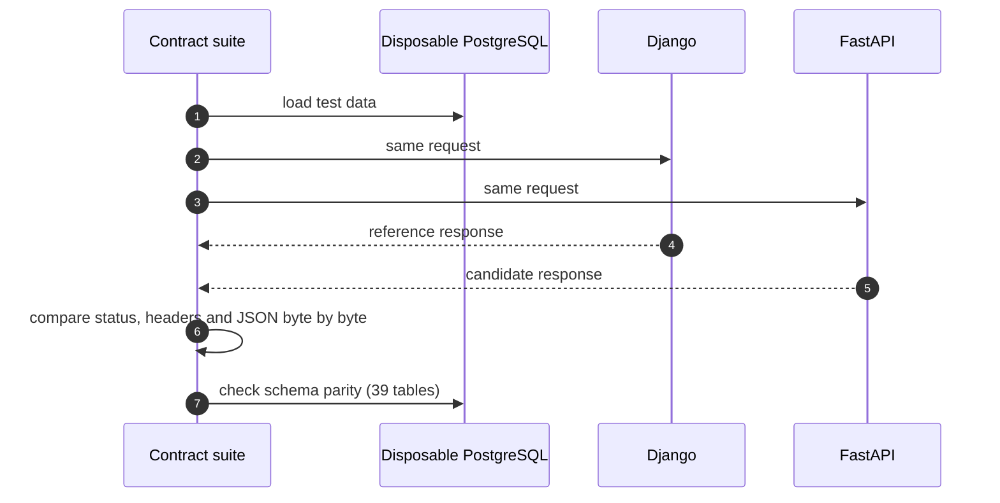

[Zona Repuestera](https://zonarepuestera.com.co) is an online auto-parts store in Colombia. It is **independent** work I do on the side: I built the system that runs in production, and I am now finishing its rewrite to a modern architecture **without stopping sales**.

The store has three kinds of users: shoppers (guest or registered, with OTP or Google sign-in), the store team through the admin panel, and a **WhatsApp bot** that looks up orders, catalog and recommendations through the API.

## The production system

- **Vehicle-compatibility search**: every product is linked to the compatible vehicle models (make → model), which drives navigation and recommendations.
- **A catalog the store can run itself**: bulk import from Excel and image ZIPs, category and product aliases for better search, inventory pricing and physical warehouse location.
- **Complete orders**: anonymous or user carts, billing to individuals or companies, carrier shipping or in-store pickup, status history, order PDFs and auditing.
- **Images optimized on upload** (HEIF, mozjpeg) and SSR pages with a one-hour cache that is invalidated when products or categories change.

## Stock-driven Google Merchant

The Google Shopping catalog stays in sync automatically, so sold-out or unpriced products are never advertised.

## The rewrite: a contract-verified strangler fig

The monolith did its job, but growing required a faster, typed API, an SSR/ISR storefront and a dedicated admin panel. Instead of rewriting everything and switching over in one go, I applied the **strangler fig** pattern: the new system lives alongside the old one on **the same database** and replaces its routes gradually.

- **Full compatibility during the transition**: JWTs are SimpleJWT-compatible, so sessions work on both systems; *presenters* return exactly DRF's JSON shape, and public URLs are frozen so SEO and the Merchant feed are not lost.
- **Explicit side effects**: Django's implicit signals (email, PDF, Merchant, images, counters) become hooks and events declared in code.
- **Generic admin panel**: 29 resources are described by a `/meta/` endpoint, and the front end generates its types from the OpenAPI schema.

## How we make sure nothing breaks

- **1,445 contract tests** run each request against both systems on the same database and require identical responses.
- The SQLAlchemy mapping is **generated from the Django models**, so the schema cannot drift while Django owns it.
- The WhatsApp bot contracts are **frozen**, including some legacy quirks that are replicated on purpose.
- During the rewrite I also ran a security review and **fixed issues in payment verification, resource authorization, social login and OTP code generation**, each covered by tests.

## Quality

- **464 tests** in the production system.
- In the new stack: async pytest tests; 52 unit and 15 e2e tests in the storefront; 46 unit and 12 e2e tests in the admin.
- **GitHub Actions** with lint, types, tests, `pip-audit`, `npm audit` and `knip`, with actions pinned by SHA. Deployments are intentionally kept out of CI until the cut-over.
- A workspace set up for **AI-assisted development**, with `AGENTS.md` and `CLAUDE.md` describing each repository's contracts and rules.
