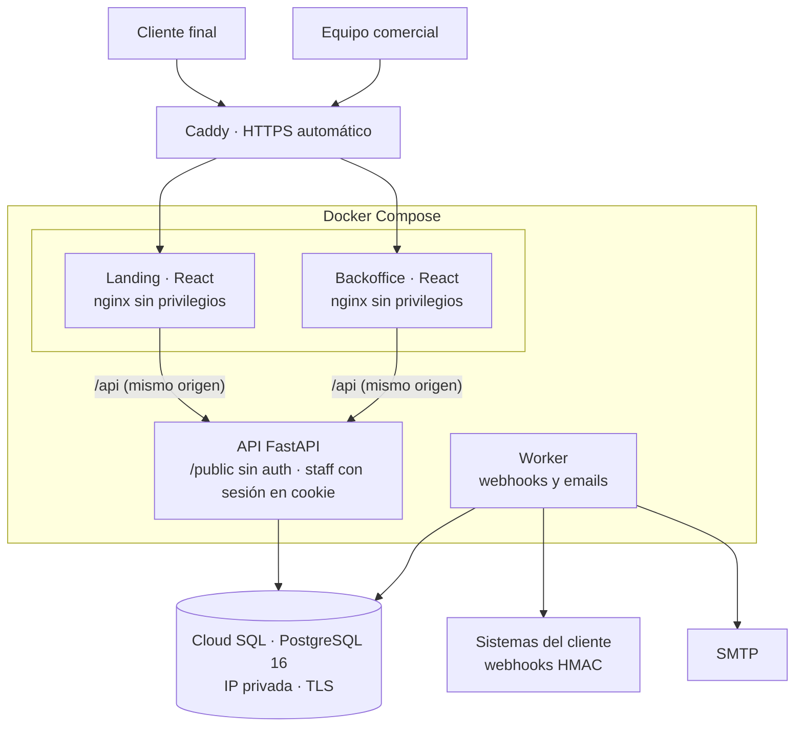
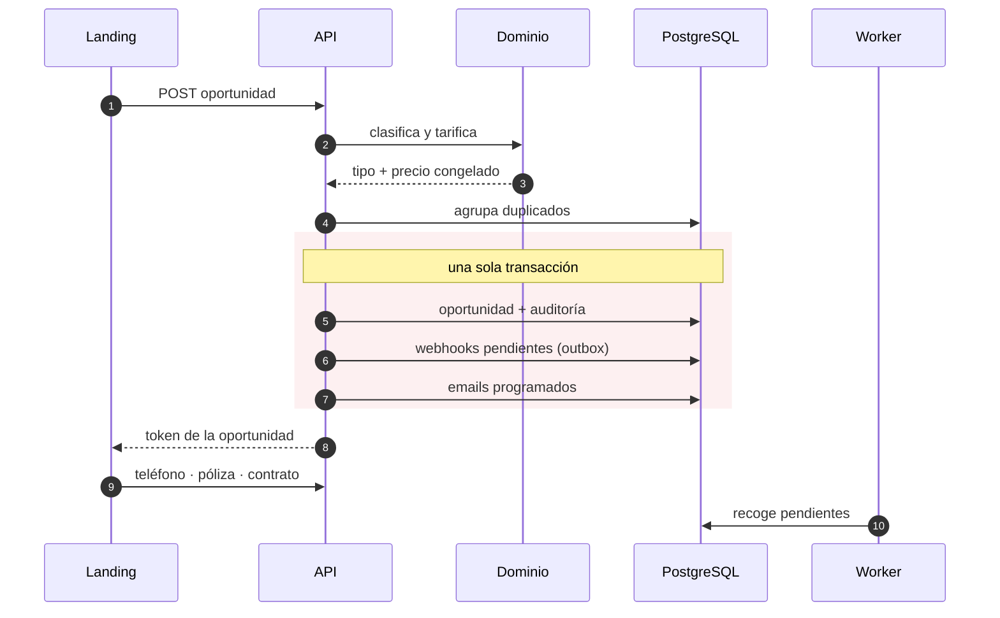
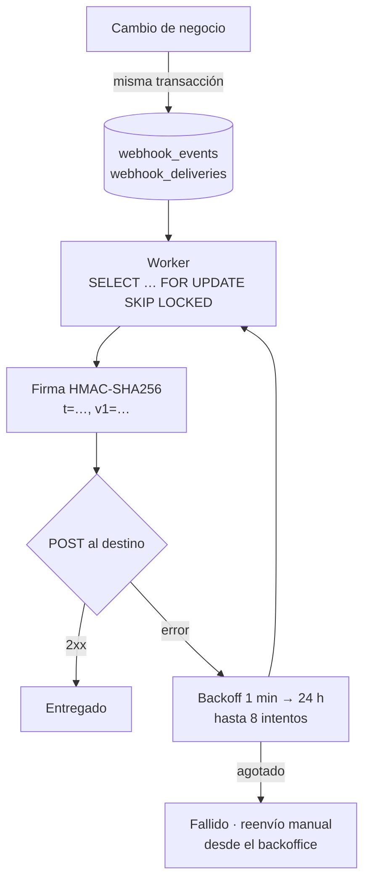
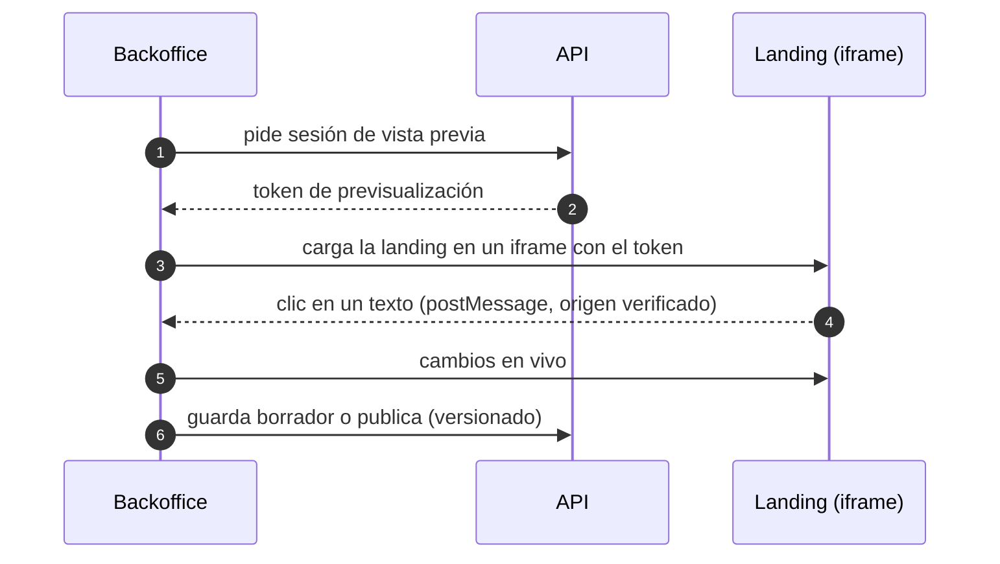

**SegurCaixa Mascotas** es la plataforma con la que SegurCaixa Adeslas vende su seguro para perros y gatos. La estoy construyendo de principio a fin: la API, las dos aplicaciones web, la infraestructura y los pipelines.

- **Landing pública de contratación**: cotización en 3 pasos, parrilla de precios para una o varias mascotas con códigos y promociones, solicitud de llamada gratuita, solicitud de póliza, alta online en 2 pasos y un buscador de clínicas veterinarias con mapa.
- **Backoffice para el equipo comercial**: bandeja tipo CRM de leads y oportunidades, métricas, auditoría, usuarios con 4 roles, webhooks, CMS visual de textos y emails, administración de tarifas y red de clínicas.

La versión 0.1 ya está desplegada en el entorno de desarrollo sobre GCP y el trabajo sigue: automatizaciones de email, detección de duplicados, pipeline comercial y editor visual.

## Arquitectura

- **Capas estrictas y en un solo sentido**: rutas → servicios → repositorios → modelos. Las reglas de negocio (tarificación, permisos, funnel, catálogo de webhooks, esquemas de contenido) viven en una capa de **dominio pura, sin I/O**, que es la única fuente de verdad. Los frontends solo las replican para mostrarlas; la autoridad siempre es el servidor.
- **Mismo origen para cada frontend**: nginx hace de proxy de `/api`, así que la sesión viaja en una cookie `httpOnly` `SameSite=Strict` sin configurar CORS.
- **Infraestructura deliberadamente austera** para desarrollo: una VM con Docker Compose y Cloud SQL, sin Kubernetes ni registry. El despliegue construye las imágenes, las copia a la VM y levanta los servicios con `compose up --wait`. La API aplica las migraciones al arrancar.

## Del presupuesto al contrato, en una transacción

- **Precio congelado.** El precio se calcula y se guarda en el momento de la cotización. Las tarifas se versionan por fecha de vigencia (zona horaria Europe/Madrid) y los descuentos no se acumulan: gana el mayor.
- **Leads que solo avanzan.** Cada oportunidad se clasifica por tipo y solo puede avanzar. Los duplicados por email o teléfono en 90 días se agrupan y el registro más avanzado queda como principal.
- **Idempotencia en los POST públicos** con `Idempotency-Key`, para que un doble clic o un reintento de red no creen dos oportunidades.

## Webhooks con transactional outbox

Los sistemas del cliente reciben **17 tipos de evento**. Para que un fallo de red nunca pierda ni duplique un evento de negocio, uso el patrón **transactional outbox**:

- El evento se escribe **en la misma transacción** que el cambio que lo origina. Si la transacción falla, el evento no existe; si se confirma, el evento se entregará tarde o temprano.
- `FOR UPDATE SKIP LOCKED` permite varios workers sin entregas dobles.
- Cada destino tiene su propia autenticación (bearer, cabecera propia o básica) además de la firma. Las URLs de destino pasan por una **protección contra SSRF** y los secretos y payloads se guardan cifrados con Fernet.
- La documentación de los webhooks se genera desde los **mismos builders** que producen los envíos reales, y cada evento se puede enviar como prueba desde el backoffice.

Los **emails automáticos** siguen el mismo esquema: el evento crea el mensaje programado y, cuando llega su hora, el worker vuelve a comprobar la condición, el consentimiento, la lista de supresión y la vigencia (descarta lo que tenga más de 48 h). Todo email de marketing lleva un enlace firmado de baja y la cabecera `List-Unsubscribe`.

## CMS visual sin despliegues

El equipo comercial edita los textos de la landing y de los emails **sobre la propia página**, sin tocar código:

- Cada texto editable lleva **marcadores invisibles de ancho cero** que identifican su campo, así que no hace falta instrumentar el HTML a mano.
- El contenido usa un **marcado propio y seguro** (negrita, cursiva, subrayado, colores de marca y enlaces internos), nunca HTML libre. En los emails se convierte en estilos inline.
- Las reglas CSP `frame-ancestors` y `frame-src` solo permiten que estas dos aplicaciones se enmarquen entre sí.

## Seguridad y privacidad

- **Sesión**: JWT con `jti` en una cookie `httpOnly`, CSRF *double-submit*, contraseñas con argon2, bloqueo tras 5 intentos fallidos, lista de tokens revocados e invalidación de sesiones al cambiar la contraseña.
- **Datos sensibles** (documento de identidad, IBAN) **cifrados** en la base de datos. Las exportaciones CSV y Excel neutralizan la inyección de fórmulas, los formularios públicos tienen *honeypot* y todas las respuestas llevan cabeceras de seguridad.
- La API **se niega a arrancar** en staging o producción si detecta secretos de desarrollo.
- **Analítica propia y respetuosa con la privacidad**: no se envía nada antes del consentimiento, el backend descarta los datos personales y cada sesión se vincula al lead para ver su recorrido por los 10 pasos del funnel. Las etiquetas de Google Ads, Meta y GA4 solo se cargan con consentimiento de marketing.
- **RGPD**: un comando de retención anonimiza los leads antiguos y purga la analítica vieja.

## Calidad

- **Backend**: 145 tests contra PostgreSQL real, **94 % de cobertura** con ramas y un mínimo obligatorio del 90 %; `mypy --strict`, Ruff con reglas de seguridad, `pip-audit` y `detect-secrets`.
- **Frontends**: más de 180 tests con Vitest, Testing Library y MSW, más **26 tests e2e con Playwright** en escritorio y móvil, incluido el flujo de recuperación de contraseña a través de un buzón de pruebas.
- **CI en Bitbucket Pipelines** con pasos paralelos de calidad, seguridad y tests, y hooks que exigen Conventional Commits, bloquean secretos e impiden commits directos a `main`.
- Una prueba de carga local sostuvo unas 160 peticiones/s sin errores y con un p95 por debajo de 0,8 s con 50 usuarios concurrentes.
