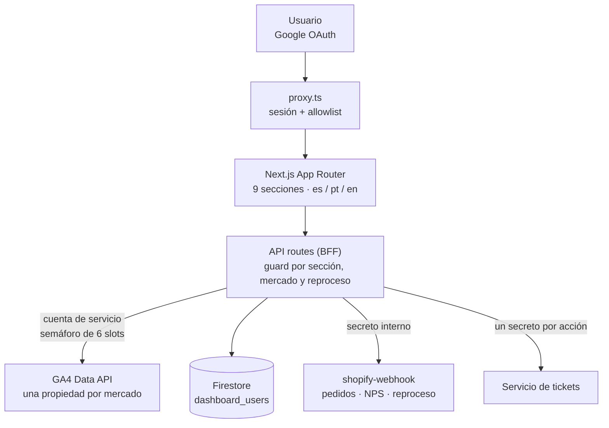
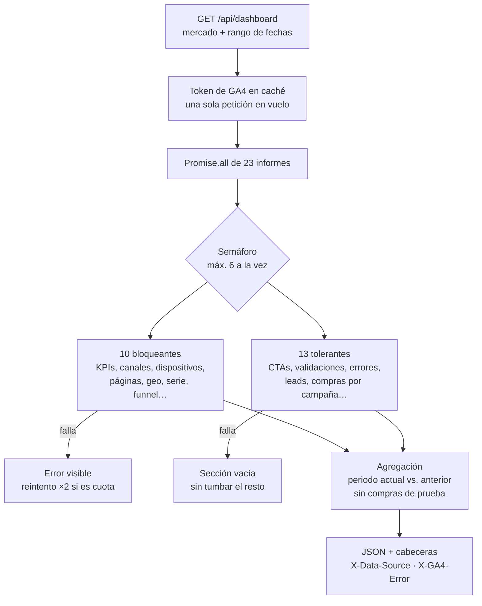
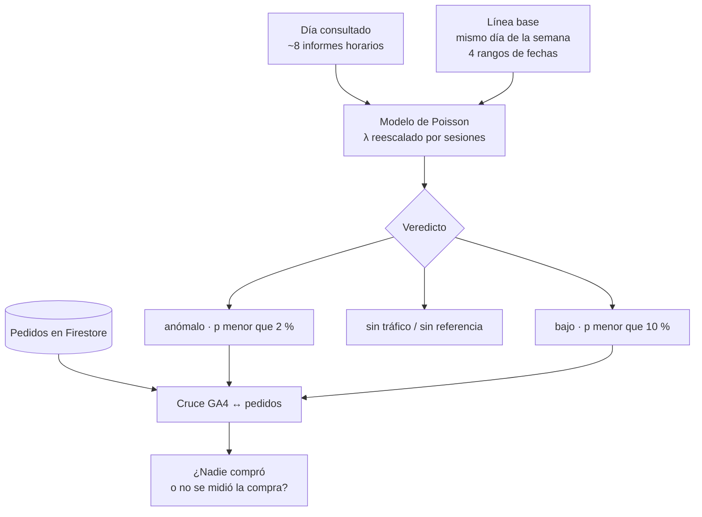

El equipo de marketing de Culligan no confiaba en los números de GA4: la atribución del funnel se perdía y nadie sabía responder rápido a preguntas como *"hoy hubo 0 compras, ¿por qué?"*. Construí un **dashboard interno** que reúne tráfico, conversión, funnel, pedidos, NPS y soporte en un solo lugar, con los números auditados y separados por mercado (España, Portugal y una vista comparativa).

Lo usan el equipo de negocio y marketing, analistas y administradores, cada uno con permisos distintos.

## Arquitectura

- **Backend-for-frontend.** El navegador nunca habla con GA4, Firestore ni los microservicios: todo pasa por rutas API que validan permisos y ocultan los secretos.
- **GA4 con cuenta de servicio**, separada de la identidad del usuario. Así los usuarios no necesitan permisos en Google Analytics, y la puerta queda abierta a alertas programadas.
- **Configuración multi-mercado** por variables `NOMBRE_ES` / `NOMBRE_PT`. Portugal no hereda la configuración de España por defecto: si falta una variable, el mercado aparece deshabilitado en lugar de mostrar datos de otro país.

## Carga del dashboard: 23 informes en paralelo sin romper la cuota

- GA4 admite 10 peticiones concurrentes por propiedad. Un **semáforo de proceso** limita la concurrencia real a 6 y el token de acceso se cachea con una única petición en vuelo, así que una carga no genera más de 22 tokens.
- Los informes se dividen en **bloqueantes**, sin los que la vista no tiene sentido, y **tolerantes**, que devuelven vacío si fallan. Un bug real enseñó a no esconder los errores de cuota como secciones vacías: ahora se reintentan con backoff y se muestran.
- **Nunca datos simulados.** Sin credenciales, la API devuelve ceros y cabeceras que activan avisos en la interfaz, para que nadie confunda una demo con la realidad.

## Funnel reconstruido desde las URLs

El funnel de suscripción tiene 11 pasos. Lo reconstruyo con los parámetros de la URL (`?cta=&step=&flow=&product=`) y, como alternativa, con eventos personalizados. Para que el funnel no engañe:

- El abandono se mide contra el **total declarado y el siguiente paso con tráfico**, nunca contra el paso anterior.
- Las entradas a mitad del funnel se muestran aparte como *"+N entran aquí"* en lugar de producir abandonos negativos.
- Un informe específico cruza compras con campañas por producto, porque la redirección al pago perdía la atribución de la sesión.

## Diagnóstico diario de anomalías

El dashboard compara el día con los mismos días de la semana anteriores, ajusta la expectativa al tráfico real con un modelo de **Poisson** y cruza las compras de GA4 con los pedidos reales de Firestore. Así distingue *"nadie compró"* de *"compraron, pero la medición falló"*. Los días se agrupan en horario de Madrid.

## Permisos en tres capas

- **Identidad** con Google OAuth (solo `openid email profile`) y **autorización** con una allowlist en Firestore. Los permisos se guardan expandidos en tres ejes (secciones, mercados y `canReprocess`), con plantillas de rol *admin*, *analista* y *lector*, y el JWT los relee cada 5 minutos.
- **Middleware** que corta el acceso sin sesión, **guards por ruta** en el servidor (la capa que realmente protege) y una función isomórfica, *fail-closed*, que solo decide qué dibuja la interfaz.
- **Reglas de seguridad administrativas**: nadie puede editarse ni borrarse a sí mismo, siempre queda al menos un administrador activo y hay administradores de arranque como red de seguridad.

## Números en los que se puede confiar

Construí una **auditoría de métricas** que evalúa cada cifra (imposible, contradictoria, cero con denominador distinto de cero) contra datos en vivo y contra fixtures. En 5 ejecuciones llegó a 0 fallos y destapó dos problemas reales:

- una métrica que se leía por posición mostraba *sesiones por usuario* como *páginas por sesión*; ahora las métricas se leen por nombre de cabecera;
- tráfico de Portugal contaminaba la propiedad GA4 de España durante una semana.

La vista **Comparar** usa tasas, diferencias en puntos porcentuales y series rebasadas a 100, y lanza una petición por mercado para que uno pueda fallar sin afectar al otro.

## Despliegue

Imagen Docker multi-stage que se ejecuta sin root, con **Cloud Build → Artifact Registry → Cloud Run** y secretos inyectados desde Secret Manager. El servicio es público a nivel de red a propósito, porque la aplicación hace su propia autenticación.
