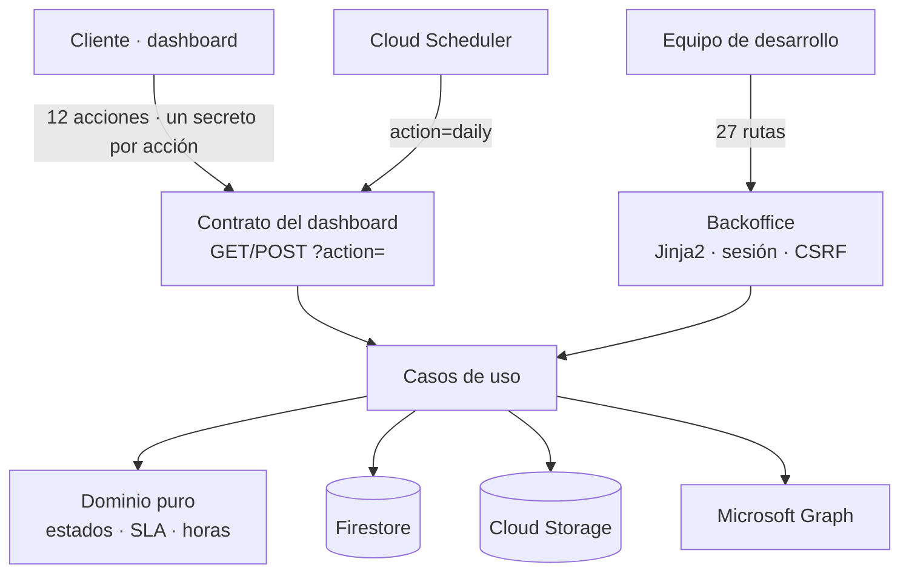
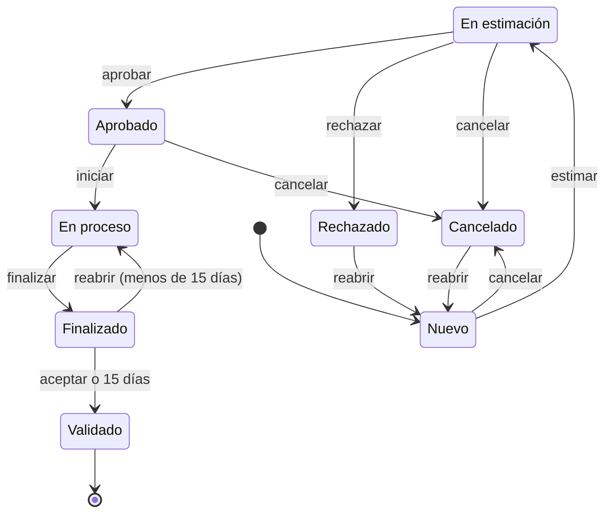
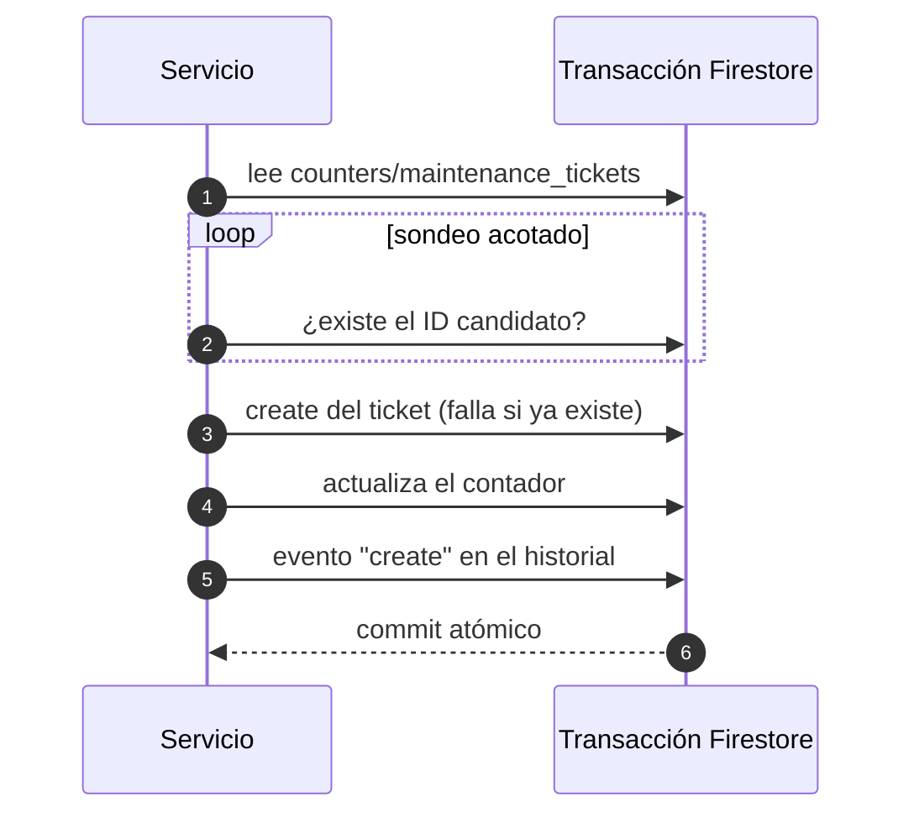

Los tickets de mantenimiento entre Culligan y el equipo de desarrollo vivían en un flujo de **Power Automate, una hoja de Excel y tarjetas de Teams**. El contador de IDs de la hoja dejó de avanzar y un día un ticket nuevo recibió el ID de otro existente y **lo sobrescribió**. Reescribí el sistema como un **servicio propio en FastAPI** con dos caras: la sección *Mantenimiento* del dashboard para el cliente y un backoffice para el equipo.

## Arquitectura

- **Capas con dependencias hacia dentro**: el dominio es lógica pura (estados, transiciones, SLA, bolsa de horas) y los repositorios, el almacenamiento y el notificador se inyectan desde un contenedor.
- **Mantuve el contrato del dashboard tal cual**, así que la reescritura no exigió tocar el cliente.
- **Un secreto distinto por acción**: si se filtra el de lectura, no sirve para crear ni para aprobar tickets. La vista del cliente se filtra en el servidor, así que las notas internas, las rutas de almacenamiento y el historial de campos nunca salen del servicio.

## Ciclo de vida del ticket

- Cualquier transición no declarada devuelve **409**. Cancelar y reabrir exigen un motivo.
- Si el cliente cambia el alcance después de la estimación, el ticket vuelve a *Nuevo*. Una vez aprobado, solo puede cambiar la prioridad.
- **SLA en horas naturales** mientras el ticket espera al equipo: prioridad alta 24 h, media 72 h, baja 120 h. Un mensaje del cliente sin responder devuelve la pelota al equipo.

## IDs que nunca se repiten

El bug original era un contador que no avanzaba. Ahora la asignación del ID y la creación del ticket ocurren en **una sola transacción de Firestore**:

- `create` **se niega a sobrescribir** un documento existente, aunque el contador estuviera mal.
- Cada cambio de estado pasa por un único método que, en la misma transacción, verifica el estado actual, aplica el cambio y escribe un evento con los valores anteriores y nuevos. El historial es **solo de escritura**.
- Una **migración idempotente**, en modo *dry-run* por defecto, recuperó el ticket sobrescrito, renumeró los afectados y dejó eventos de auditoría de la importación. Un test de regresión garantiza que los IDs no se repiten.

## Bolsa de horas, informes y job diario

- **Bolsa de horas por categoría** (desarrollo, arquitectura, PO). Las recargas son solo de escritura (una corrección es una recarga negativa) y el saldo es la suma de recargas menos las horas imputadas. Las imputaciones son por persona, categoría y día, y se anulan en lugar de borrarse.
- **Informe mensual** en JSON, CSV o una página imprimible, con saldo inicial, recargas, consumo y saldo final.
- **Job diario con Cloud Scheduler**, idempotente: valida automáticamente los tickets finalizados hace 15 días o más y envía al equipo un resumen de los que están fuera de SLA.
- **Adjuntos** en un bucket privado: se filtran por extensión y por *magic bytes*, con un máximo de 10 MB por fichero y 5 por mensaje, y solo se sirven a través del servicio.
- **Email con Microsoft Graph**, porque Exchange Online retiró la autenticación básica por SMTP. Un fallo de email nunca hace fallar la acción.

## Bugs difíciles que resolví

- **Sesiones que desaparecían.** Cuando el reloj del sistema retrocedía por un ajuste de NTP, las cookies firmadas se consideraban inválidas y Starlette descartaba la sesión en silencio. Lo resolví con un firmador basado en un reloj monótono.
- **Campos borrados al sincronizar.** Una escritura con *merge* que traía campos vacíos borraba datos del ticket. Ahora los valores vacíos entrantes no pisan un valor guardado.

## Calidad y despliegue

- **180 tests offline** con un doble de Firestore en memoria que reproduce las transacciones y la semántica de `create`. La cobertura con ramas es del **98 %** con un mínimo del 95 % en cada ejecución.
- **Bitbucket Pipelines** con isort, Black, Ruff y pytest.
- Un `deploy.sh` que se niega a desplegar con el árbol sucio o con tests en rojo, arranca el contenedor y comprueba `/healthz`, avisa de las variables obligatorias que faltan y **nunca sobrescribe variables de entorno**, así que un despliegue no puede dejar un secreto en blanco.
