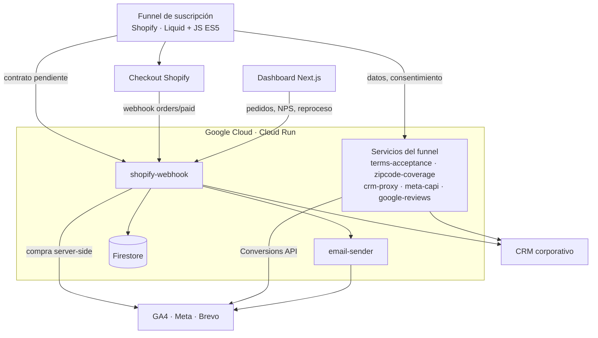
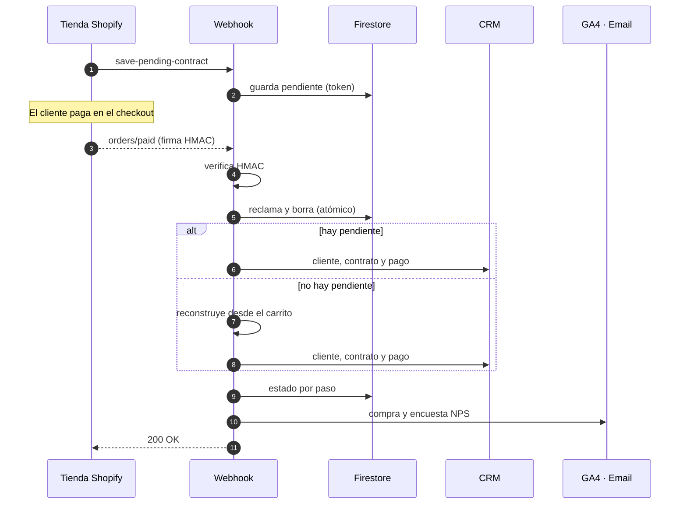
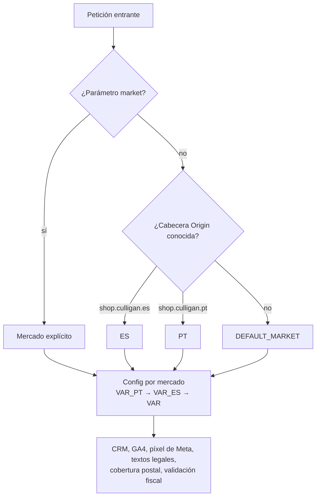
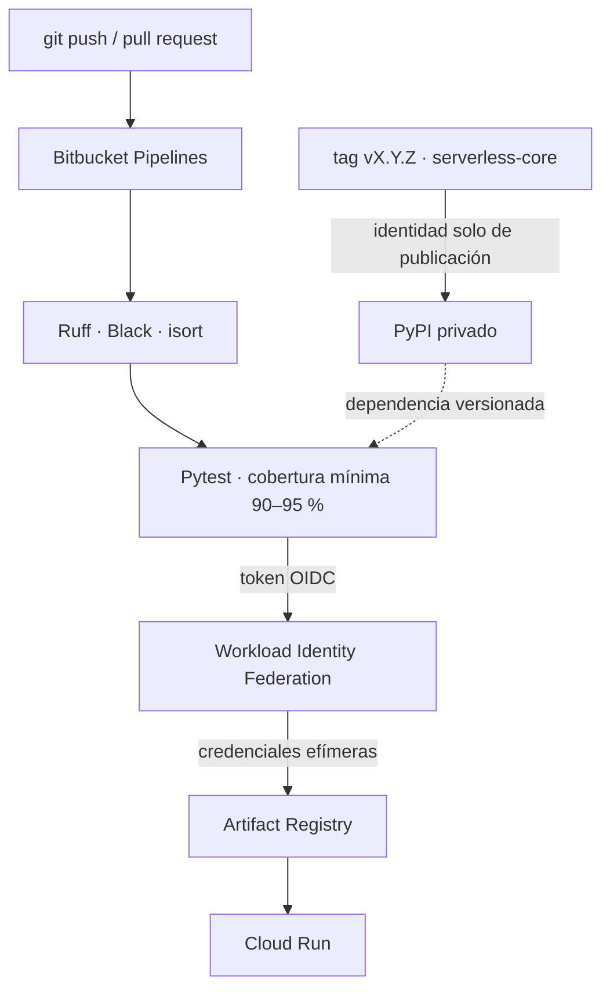

Culligan vende en línea dispensadores de agua por suscripción: el equipo más las recargas periódicas. El objetivo del proyecto era que **una venta completa ocurriera sin intervención humana**, desde que el cliente elige un plan hasta que el contrato queda dado de alta en el CRM corporativo con su primer cobro registrado.

Fui el responsable técnico y el desarrollador principal: el funnel de la tienda, los microservicios, el dashboard, la infraestructura y la documentación técnica entregada al cliente.

## Arquitectura

El sistema tiene cuatro piezas: una **tienda Shopify** con un funnel de suscripción a medida, **8 microservicios serverless en Google Cloud**, un **dashboard privado** de analítica y operación, y los **sistemas externos** (CRM, pagos, email y medición).

Cada servicio es pequeño y tiene una sola responsabilidad. Todos comparten una **librería interna versionada** (`serverless-core`) que resuelve lo transversal: routing declarativo, sobre de errores uniforme, políticas de autenticación, CORS, logging sin datos personales y cliente del CRM.

## El webhook de pedidos: contratos solo después del pago

La decisión de arquitectura más importante fue **mover la creación del contrato al webhook de pago**. En la primera versión el contrato se creaba desde el navegador antes de pagar, y eso generaba contratos "fantasma" cuando el cliente abandonaba el checkout.

Ahora el funnel solo guarda un **contrato pendiente** en Firestore, identificado por un token imposible de adivinar que viaja en las propiedades ocultas del carrito. Shopify confirma el pago con el webhook `orders/paid` y el backend completa todo el alta:

Qué hace robusto a este flujo:

- **Autenticación fail-closed.** El endpoint del webhook exige la firma HMAC de Shopify calculada sobre el body crudo. Si falta el secreto de configuración, rechaza la petición en lugar de dejarla pasar.
- **Deduplicación atómica.** Shopify garantiza la entrega *at-least-once*: reintenta hasta 19 veces en 48 h y puede entregar el mismo evento dos veces casi a la vez. El pendiente se reclama y se borra dentro de una transacción de Firestore, así que solo una entrega puede crear el contrato.
- **Reconstrucción.** Si no hay pendiente (compras desde landings, datos perdidos), el contrato se reconstruye con las propiedades ocultas del carrito y una tabla precio → plantilla. Cada uno de los cuatro escenarios posibles (`happy`, `landing_gap`, `funnel_gap`, `true_gap`) genera una alerta distinta en Sentry.
- **Estado por paso e idempotencia.** `processed_orders` registra por separado el contrato, el pago, GA4 y el NPS. El botón **"Reprocesar"** del dashboard reintenta solo los pasos fallidos, nunca duplica la analítica y es la única acción manual con permiso de escritura en el CRM.
- **CRM poco amigable.** El CRM devuelve HTTP 200 incluso en los errores y no es idempotente al crear contratos. Por eso las llamadas usan timeouts explícitos, una cabecera `Idempotency-Key` y verificación TLS con un bundle de CA propio en lugar de desactivarla.

## Un código, dos mercados

La expansión a **Portugal** se diseñó como multi-mercado desde el código, no como una copia del proyecto:

- El **tema de Portugal** se clonó del de España y se tradujo a portugués europeo. Los textos de la interfaz se centralizaron en un diccionario para poder traducirlos.
- Construí una **herramienta de migración de catálogo** (productos, colecciones y metafields) sobre la **Shopify Admin GraphQL API**. Es idempotente, ejecuta primero en modo *dry-run*, pagina más allá del límite de 250 nodos y es no destructiva por diseño: hay un test que garantiza que no contiene ninguna mutación de borrado.
- Mientras España no podía desplegar todavía la versión multi-mercado, Portugal corrió en un **clúster temporal de 8 servicios `-pt`**. Los dos mercados comparten Firestore y cada pedido queda etiquetado con su mercado. El plan documentado es volver a unificar los servicios.

## CI/CD sin llaves y calidad

- **Ninguna llave de cuenta de servicio almacenada.** El CI se autentica en GCP con tokens OIDC de Bitbucket y Workload Identity Federation. Hay una identidad de solo lectura para todos los repositorios y otra de publicación ligada únicamente al repositorio de la librería. Eso cierra la puerta a manipulaciones de la cadena de suministro.
- **Cobertura mínima obligatoria** en cada servicio, entre el 90 y el 95 %, con **más de 1.100 tests**. Ninguno toca red ni base de datos reales: los adaptadores se inyectan.
- **Un `deploy.sh` por servicio**: exige un árbol git limpio, ejecuta los tests, construye la imagen, hace un *smoke test* del contenedor antes de desplegar y admite el modo `--market pt`.
- **Una auditoría de seguridad** alimentó el diseño de la librería. Las políticas de autenticación son declarativas y *fail-closed* por defecto (pública, por origen de navegador, secreto compartido comparado en tiempo constante, HMAC de Shopify) y los errores nunca exponen detalles internos.

## Medición server-side y navegadores embebidos

- La compra se envía a **GA4 por Measurement Protocol** desde el backend, con el `client_id` y el `session_id` del navegador para no perder la atribución. Los eventos de **Meta Conversions API** se deduplican contra el píxel del navegador con un `event_id` compartido, y los datos personales viajan hasheados.
- Buena parte del tráfico llega desde el **navegador interno de Instagram y Facebook** y desde Samsung Internet. Por eso el funnel está escrito en **ES5** (sin `async/await` ni `?.`). Con **Sentry Session Replay** diagnostiqué y resolví un bloqueo de renderizado exclusivo de esos navegadores. El botón de pago lanza llamadas en paralelo con timeouts estrictos y un *warm-up* que evita los arranques en frío de 2–3 s.

## Dashboard de operación y tickets

Dos piezas del ecosistema tienen su propio caso de estudio:

- **[Culligan Analytics](../culligan-dashboard/)**: dashboard en Next.js que carga 23 informes de GA4 en paralelo, reconstruye el funnel, diagnostica anomalías diarias con un modelo de Poisson y permite reprocesar pedidos con un clic.
- **[Culligan Tickets](../culligan-tickets/)**: el servicio en FastAPI que sustituyó a Power Automate y Excel, con máquina de estados, IDs transaccionales, SLA y bolsa de horas.

## Resultados

- La venta online funciona **de punta a punta sin intervención manual** y ya no se crean contratos sin pago.
- Hay **visibilidad completa** de cada pedido y recuperación con un clic cuando falla un sistema externo.
- El segundo país se lanzó **sin duplicar el código base**.
- Los 8 microservicios comparten una base común auditada, con CI/CD sin secretos y más de 1.100 tests.
- Entregué un **manual técnico** de unas 1.300 líneas con 12 diagramas generados desde código.
