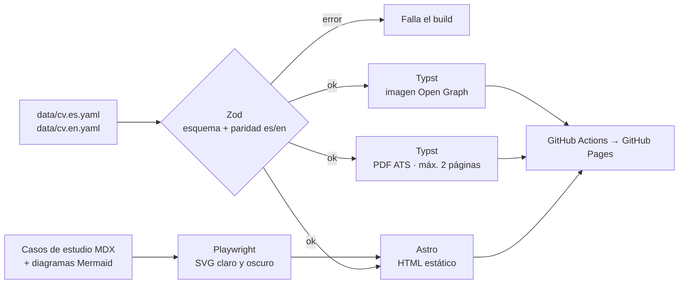

Mi CV no se edita en un procesador de texto: se **compila**. Los datos viven en un único YAML por idioma y todo lo demás se genera a partir de ellos: esta web, el PDF para los sistemas ATS, la imagen para redes sociales y los metadatos para buscadores. El código es público en [github.com/inehosa1/cv](https://github.com/inehosa1/cv).

## Decisiones

- **Typst para el PDF.** Lee el YAML directamente, compila en milisegundos y produce texto real con las fuentes embebidas, en una sola columna, para que los ATS lo interpreten sin errores. El build falla si el CV supera las dos páginas.
- **Astro sin JavaScript de cliente.** Genera HTML estático y semántico, con modo oscuro por `prefers-color-scheme`, contraste WCAG AA, JSON-LD `Person` y `hreflang`.
- **Diagramas como código.** Los diagramas de estos casos de estudio se escriben en Mermaid y se renderizan en build con Playwright a SVG, en una variante clara y otra oscura. No se carga ninguna librería en el navegador.
- **Validación estricta.** El esquema rechaza campos desconocidos y comprueba que la versión en español y la versión en inglés tengan exactamente la misma estructura.
- **Privacidad.** El teléfono aparece solo en el PDF, nunca en el HTML ni en los datos estructurados.
