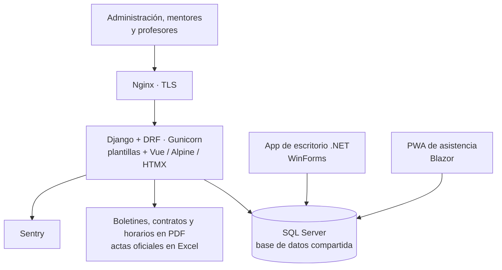
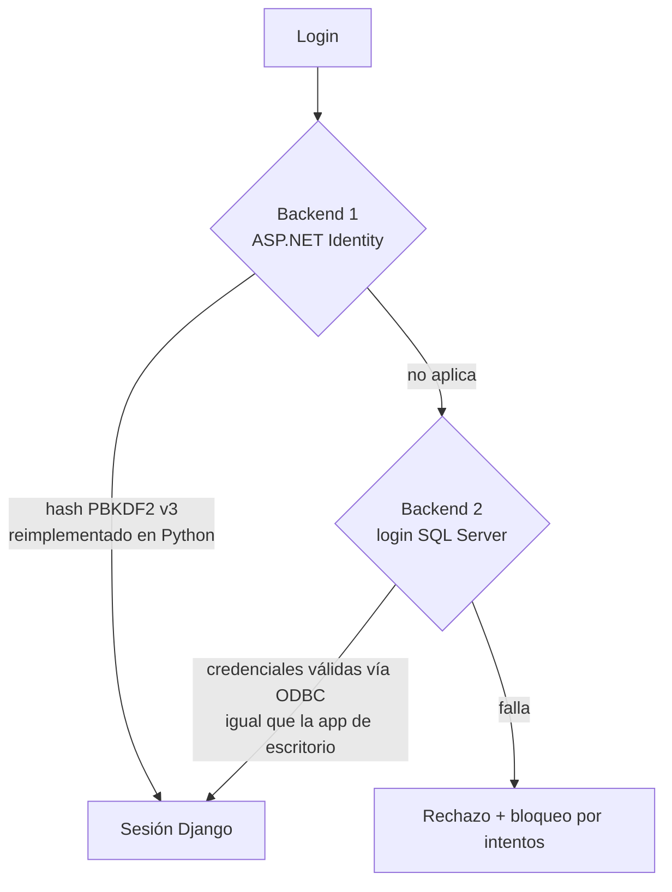
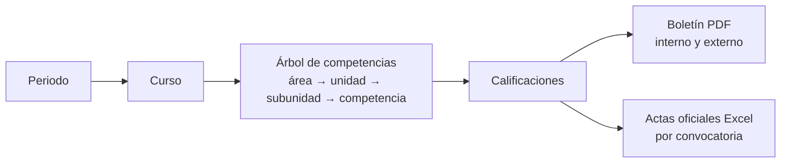

Un colegio internacional con alumnos de primero a duodécimo grado, y asignaturas de los currículos estadounidense y español, gestionaba su vida académica con varias aplicaciones **.NET**: una de escritorio en WinForms para administración y una PWA en Blazor para que los profesores pasaran lista. Me encargaron construir un **nuevo sistema web en Django** que las fuera sustituyendo, con una restricción fuerte: **las aplicaciones antiguas siguen en uso y comparten la misma base de datos SQL Server**.

Hice prácticamente todo el desarrollo (163 de 164 commits). El sistema está en producción.

## Arquitectura

- **Coexistencia, no reemplazo de golpe.** Django lee y escribe las mismas tablas que las aplicaciones .NET. De sus 57 modelos, **16 son `managed=False`** y se mapean sobre el esquema existente, con columnas calculadas y claves primarias que no son autoincrementales.
- **Dominios**: seguridad (tablas de ASP.NET Identity), usuarios (alumnos, profesores), académico (periodos, cursos, árbol de competencias, calificaciones) y organización (horarios, espacios, matrículas, asistencia, eventos).
- **Roles**: administración, mentor (solo lectura), profesor (su propio horario) y editor de horarios, con permisos de escritura aplicados endpoint por endpoint.

## Login compatible con el sistema .NET

Los usuarios no podían tener dos contraseñas. Implementé dos backends de autenticación:

- Reimplementé en Python la verificación de hashes **ASP.NET Core Identity V3** (PBKDF2), con búsqueda por usuario o por email y comprobación de bloqueo.
- Encontré y corregí un error de formato en el campo PRF del hash (1 byte en lugar de 4). Así, las contraseñas que se restablecen desde Django siguen funcionando en la PWA .NET, y rehasheé las cuentas afectadas.

## Del árbol de competencias al boletín

- **Editor del árbol de competencias** por curso, con categorías y subcategorías. Los objetivos se copian automáticamente al crear un periodo nuevo.
- **Porté de C#/iTextSharp a Python (ReportLab)** la generación de boletines, contratos y horarios de alumnos y profesores. Paginación a nivel de canvas, cabeceras repetidas y secciones que no se parten entre páginas, para que los documentos nuevos sean **idénticos a los que el colegio ya conocía**.
- **Actas oficiales** en Excel en el formato exigido: solo asignaturas españolas o todas, por convocatoria. Comandos de lote generan los juegos completos por grado.
- **Asistencia**: registro por lección, log de eventos escolares y una bandeja de justificación de ausencias filtrada por grado y periodo.

## Problemas difíciles en producción

- **De 193 s a 1,6 s.** La ficha del alumno lanzaba cientos de `COUNT` por fila (N+1). La reemplacé por una anotación con subconsulta correlacionada.
- **Siempre se mostraba el registro equivocado.** El separador de miles de la localización convertía el ID `1028` en `1,028` dentro del JavaScript de la plantilla, así que cualquier registro con ID de 1000 o más mostraba los datos de otro.
- **Cursos invisibles.** Valores `NULL` heredados en el campo de archivado ocultaban casi todos los cursos. Rellené los datos y volví *NULL-safe* todos los filtros.
- **Escribir sobre un esquema ajeno.** Un *mixin* excluye las columnas calculadas de SQL Server en los `UPDATE` y genera IDs donde la tabla no es autoincremental.
- **Borrar sin destruir.** Los cursos con matrículas se archivan en lugar de borrarse, y añadí índices de rendimiento en SQL Server.
- **Reparaciones de datos seguras**: cada corrección masiva (matrículas, años escolares) se ejecuta con una copia de seguridad previa en JSON.

## Calidad y despliegue

- **177 tests** con un *test runner* propio que crea en SQLite las tablas no gestionadas por Django, para poder probar sin el SQL Server real.
- Docker con Nginx y TLS, Gunicorn y un healthcheck que consulta la base de datos, desplegado en **AWS EC2**, con Sentry para errores.
- Mantengo una auditoría técnica propia con la deuda conocida y su prioridad.
- También hice mejoras en la PWA .NET de asistencia: navegación a días anteriores con edición solo para administración, estadísticas por curso y caché de asistencia.
