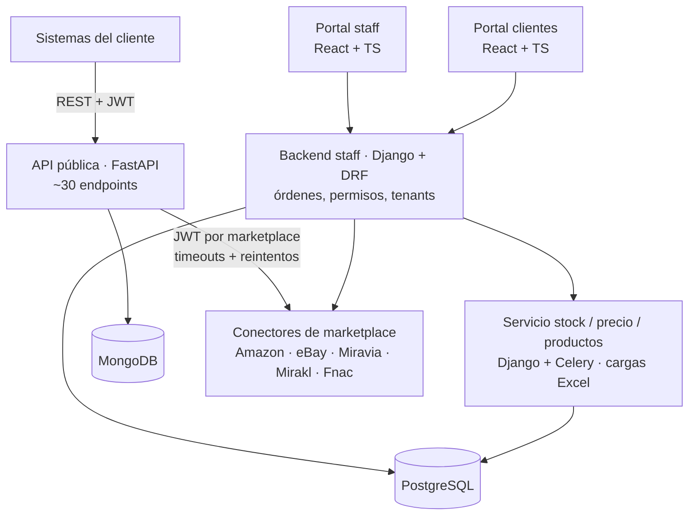
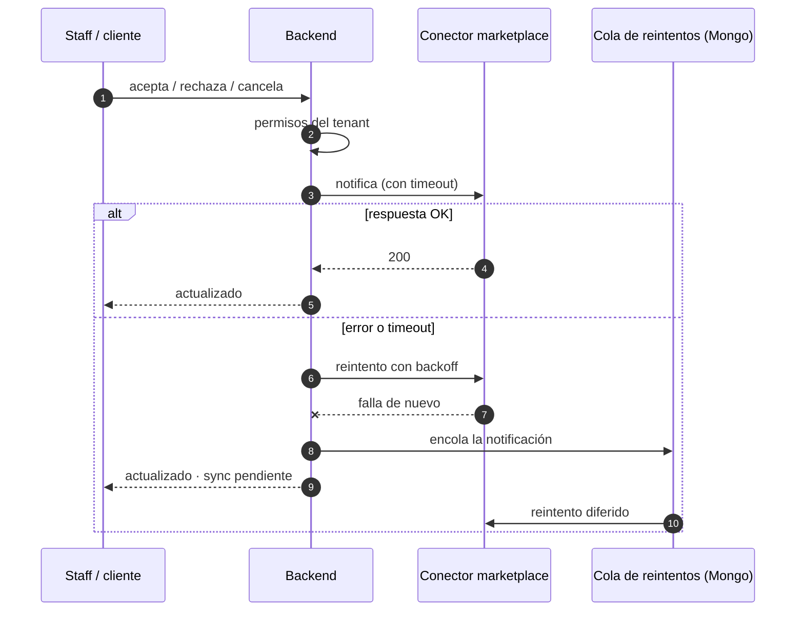
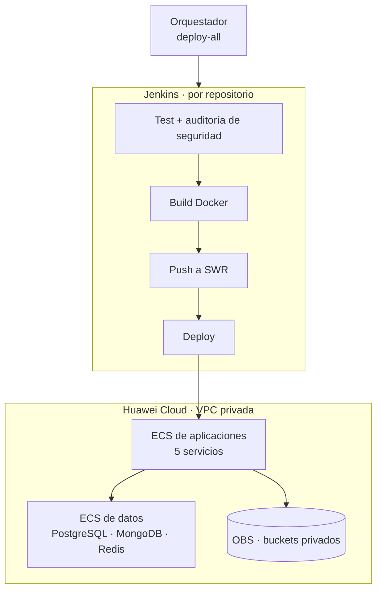

**SEB Markets** permite a los retailers gestionar desde un solo lugar productos, stock, precios, ofertas y pedidos en varios marketplaces. Es multi-tenant (cliente → tiendas → marketplace y país), tiene un portal para el staff de SEB y otro para los clientes, y ofrece una **API pública** para que los sistemas de los clientes se integren directamente.

Participé en dos etapas:

- **2024**: documentación OpenAPI y esquemas de la API, la librería de validación de producto (`market-lib`) y *fixtures* de integración con eBay.
- **2026**: me asignaron para **ayudar a probar e integrar** todo el workspace. Ese trabajo incluyó mejoras de seguridad, testing y resiliencia, y apoyo en la migración de la plataforma a Huawei Cloud.

## Arquitectura

## Blindaje de la API pública (OWASP Top 10)

La API pública es la superficie más expuesta del sistema. Como parte de las pruebas la revisé contra el **OWASP Top 10** y reforcé cada capa:

- **Autenticación y autorización**: token obligatorio en todas las rutas de negocio, autorización por marketplace y **rate limiting** del login por usuario y por IP (respuesta 429).
- **Entrada y salida**: los identificadores se sanean antes de enviarlos a los conectores, las subidas de ficheros tienen protección contra *path traversal*, las cabeceras de seguridad (CSP, HSTS…) están activas y la documentación interactiva se oculta en producción.
- **Dependencias**: actualicé Python (3.10 → 3.12), FastAPI y Starlette y sustituí `python-jose` por PyJWT. Las vulnerabilidades reportadas por `pip-audit` bajaron de **28 a 0**.
- **Observabilidad**: logs JSON estructurados con `request_id` y eventos de auditoría.
- **Contenedores y pipeline**: imagen Docker que se ejecuta sin root y una etapa de auditoría de seguridad (pip-audit y bandit) en Jenkins.

La suite de la API pasó de 396 tests (~92 %) a **506 tests con un 99 % de cobertura**. Usé `respx` para simular los conectores HTTP y `mongomock-motor` para MongoDB, así que ningún test depende de servicios externos.

## Resiliencia en la sincronización de pedidos

Antes, un marketplace caído o lento podía dejar pedidos desincronizados sin que nadie se enterara. Rediseñé el flujo de cambios de estado de las líneas de pedido:

## Aislamiento multi-tenant en el backend Django

- **Reescribí la validación de permisos**: guardaba estado en atributos de clase compartidos entre peticiones e hilos, una condición de carrera que podía mezclar permisos entre usuarios.
- Añadí permisos por método HTTP y bloqueo de escalada de privilegios, con un despliegue gradual **`warn` → `enforce`**: primero se registran las violaciones y después se bloquean, sin romper a los clientes existentes.
- Nuevo **contrato de Orders API v1** con upserts y filtros.
- **208 tests** nuevos en un backend que no tenía suite.

En el servicio de stock, precios y productos añadí validación real de las cargas Excel y endpoints de creación idempotentes (409/404), corregí problemas de seguridad y de aislamiento entre tenants y alcancé **154 tests con un 89 % de cobertura**. El contenedor ahora ejecuta migraciones y gunicorn en lugar del servidor de desarrollo.

## Migración a Huawei Cloud

Como parte del trabajo de integración apoyé el paso a Huawei Cloud: pipelines, scripts de despliegue y validación de punta a punta.

- Despliegue sobre VMs con una **VPC privada**, security groups restringidos y un *datastore* separado de las aplicaciones.
- **5 pipelines nuevos** (`Jenkinsfile.huawei`) con test y auditoría de seguridad, build, push y deploy; un `deploy.sh` con modos parciales, un orquestador para desplegar todo y un script de apagado nocturno para reducir costes.
- Almacenamiento de GCS a **OBS** con buckets privados.
- Evalué **FunctionGraph** (serverless) y lo descarté por las limitaciones de IAM de la cuenta. La decisión quedó documentada.
- Validé la migración de punta a punta en un Jenkins sandbox, y la validación destapó bugs de configuración reales (autenticación de MongoDB, orígenes CORS).

## Desarrollo AI-native del workspace

Para probar e integrar 10 repositorios de forma segura y repetible, preparé el entorno de trabajo con **Claude Code**:

- **8 subagentes especializados**: mapeo de repos, auditoría de contratos, auditoría de seguridad, ejecución y escritura de tests, changelog, lectura de conectores y trabajo por repositorio.
- **Skills** para las tareas repetitivas (`new-endpoint`, `new-page`, `sync-product-schema`) y **hooks** que formatean Python y validan JSON después de cada edición.
- **Reglas que impiden leer secretos** y un `AGENTS.md`/`CLAUDE.md` en cada repositorio con contratos y convenciones.
