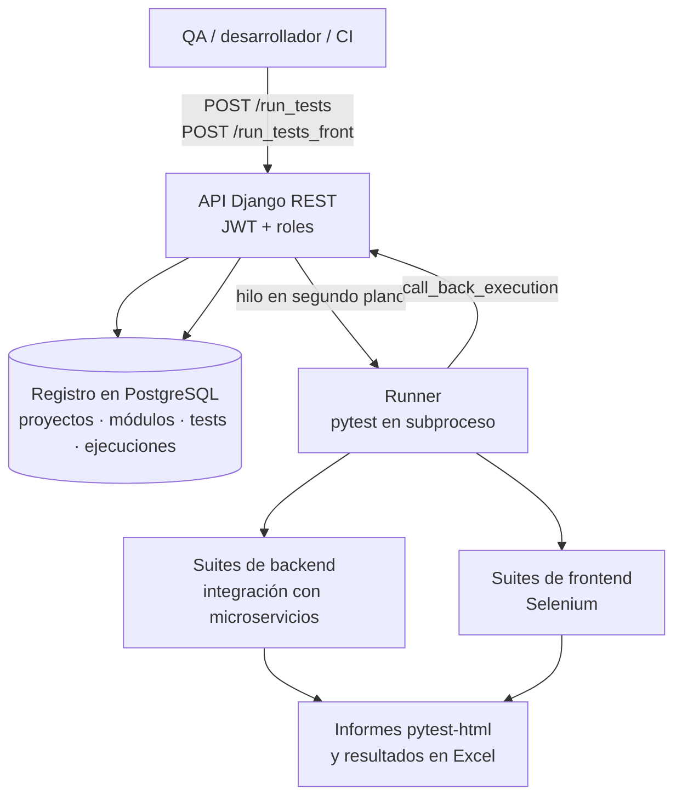
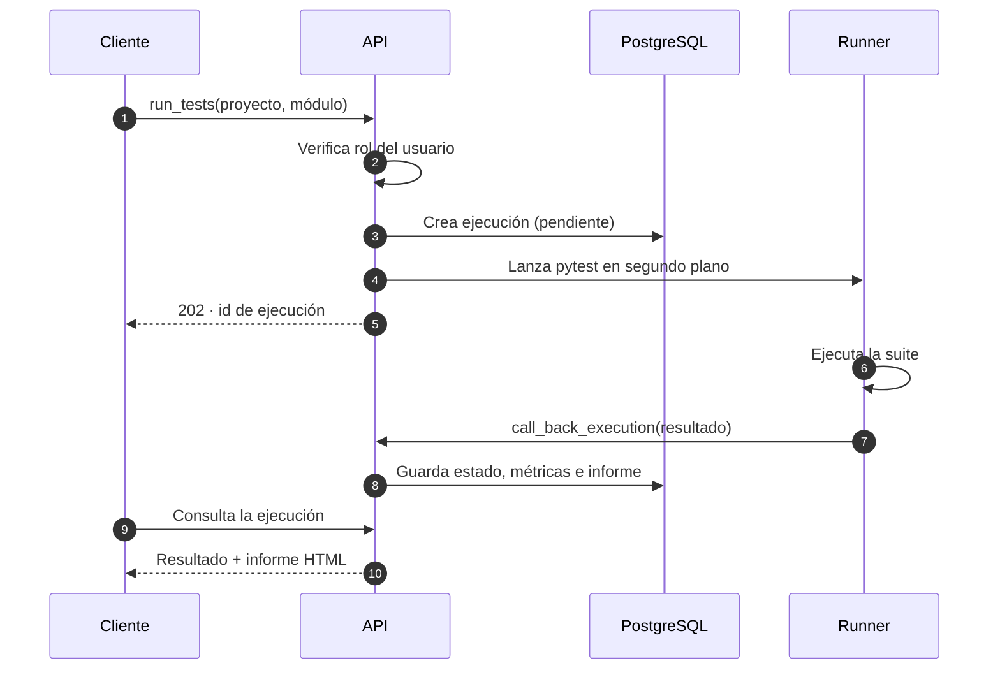

Con el crecimiento de **SEB One** llegaron más microservicios: alertas, dashboards, email, importación de pedidos, subida de ficheros de pagos y liquidaciones, y orquestación de pagos con **Hyperswitch**, **Stripe** y **Adyen**. Probar a mano cada entrega ya no escalaba. Creé **SebPay Connect**, una plataforma que convierte las suites de tests en un servicio que cualquiera del equipo puede lanzar por API.

## Cómo funciona

## Decisiones técnicas

- **Registro de tests en la base de datos.** Proyectos, módulos, tests, funciones y ejecuciones son entidades consultables, así que el historial de resultados es auditable y comparable entre versiones.
- **Ejecución asíncrona con callbacks.** La API responde al instante y el runner reporta el resultado por callback. Así las suites largas de Selenium no bloquean a quien las lanza.
- **Ejecución por roles.** Cada usuario solo puede lanzar las suites de los proyectos que le corresponden.
- **Suites de frontend separadas en repositorios propios**, una para el portal de staff y otra para el de clientes, con 63 ficheros de tests.
- **Cobertura de las integraciones de pago**: suites específicas para los flujos de Hyperswitch, Stripe y Adyen, y para las subidas de ficheros de pedidos, pagos, liquidaciones, impuestos y transacciones.
