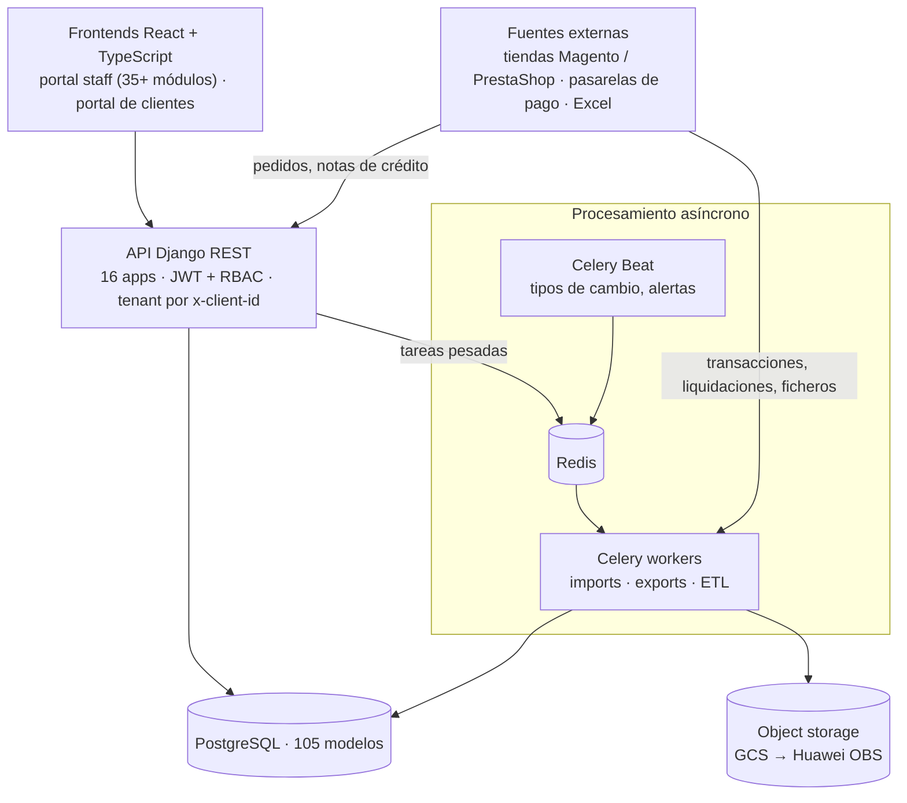
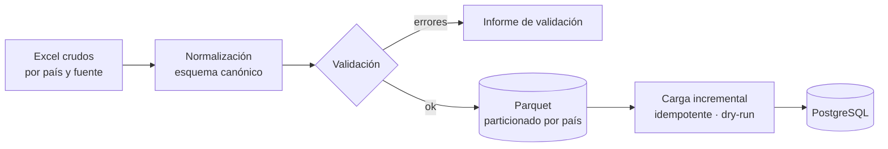
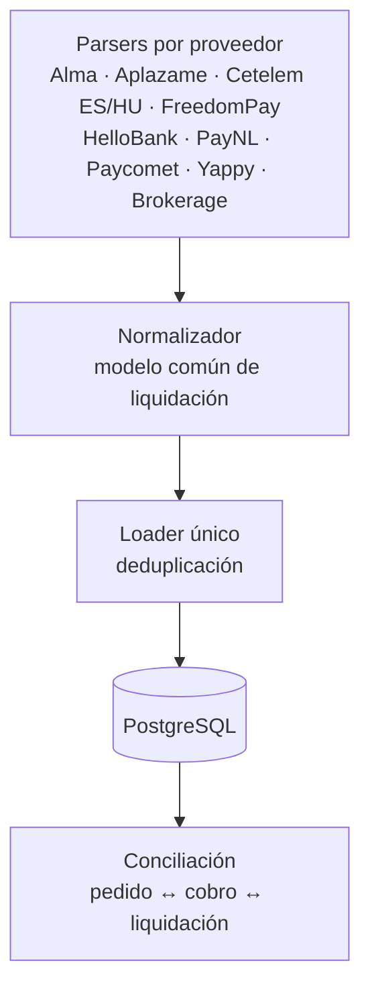
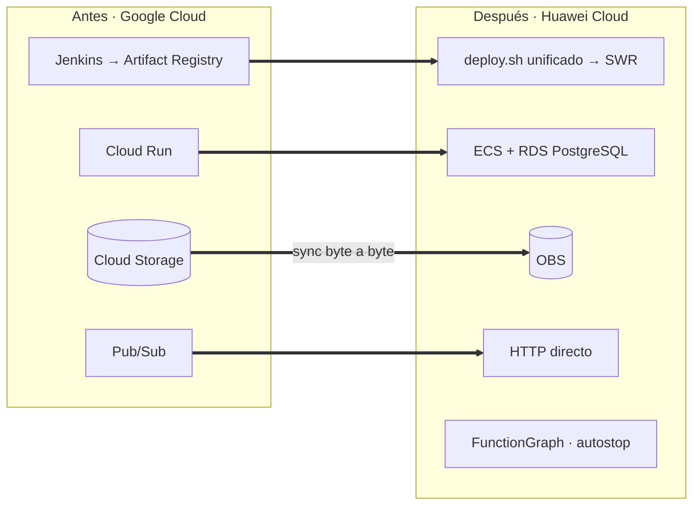

**SEB One** es el back-office que SEB Business usa para operar el comercio electrónico de marcas en **España, Francia, Países Bajos, Portugal, Hungría, República Checa y Panamá**. Allí se concilian pedidos de varias tiendas con los cobros de muchas pasarelas de pago, se emiten facturas y notas de crédito, se calculan comisiones y se gestionan reembolsos y disputas.

Trabajé en el proyecto durante unos 20 meses y fui el **principal contribuidor del backend** (974 de ~1.450 commits). También desarrollé partes de los dos frontends (staff y clientes), el tooling de despliegue y la migración de nube.

## Arquitectura

- **Multi-tenancy por petición.** Cada request lleva el cliente activo en la cabecera `x-client-id`, y la capa de permisos (RBAC con roles y permisos por módulo) filtra todas las consultas por tenant.
- **Todo lo pesado es asíncrono.** Importaciones y exportaciones masivas, recálculos y envío de documentos van a **Celery** con Redis. El usuario recibe el resultado por notificación, sin bloquear la API.
- **API documentada** con drf-spectacular (OpenAPI): 89 viewsets registrados, 89 acciones personalizadas y 66 comandos de gestión para operación y datos.

## Dominio financiero

Implementé buena parte de la lógica de negocio central:

- **Facturación**: facturas y notas de crédito totales y parciales, con descuentos y desglose de impuestos. Incluye la conciliación de notas de crédito sin emparejar, la importación de facturas recibidas y el envío por email con los adjuntos.
- **Motor de comisiones** configurable por pasarela, país, método de pago, tipo de tarjeta, número de cuotas y periodo de vigencia.
- **Reembolsos y disputas**: acciones de aprobar, rechazar, emitir y notificar; motivos de cancelación; validación de IBAN/SWIFT para devoluciones por transferencia; importación masiva desde la plantilla Excel real del cliente, con vista previa.
- **Estadísticas y dashboards** con caché, **log de auditoría** de cambios y conversión diaria de divisas a EUR con Celery Beat.

## ETL: de Excel a un data warehouse consultable

Los datos históricos llegaban como ficheros Excel heterogéneos por país. Diseñé un pipeline por etapas, reproducible en cualquier entorno con un solo comando:

- **Parquet como formato intermedio canónico**: es tipado, columnar y particionado por país, así que cada etapa se puede reejecutar de forma aislada.
- **Cargas incrementales e idempotentes** con modo *dry-run* e informes de validación antes de tocar la base de datos.
- Resultado: unas **590.000 líneas de facturas recibidas** de 7 países, más de 37.000 notas de crédito y cientos de miles de pedidos históricos de Magento y PrestaShop, cargados y consultables.

## Motor de liquidaciones de pasarelas

Cada pasarela entrega sus liquidaciones en un formato distinto. Construí un motor **dirigido por especificación**: un parser por proveedor produce un modelo normalizado común y un único loader lo persiste.

Añadir una pasarela nueva solo requiere escribir su parser y su especificación: la normalización, la carga y la conciliación se reutilizan.

## Rendimiento de base de datos

Las tablas de pedidos, pagos y transacciones crecen rápido. Diseñé **índices compuestos B-tree** para los filtros más frecuentes, índices **BRIN** para columnas temporales en tablas grandes y un **plan de particionado mensual** documentado.

## Migración de GCP a Huawei Cloud

En 2026 lideré la parte técnica de mover la plataforma de **Google Cloud a Huawei Cloud**:

- **Capa de almacenamiento conmutable** GCS ↔ OBS con URLs firmadas, así que la migración no exigió reescribir los datos. En STG se migraron 644 objetos (2,97 GB) con verificación de paridad byte a byte.
- **Un único `deploy.sh`** para construir, publicar y desplegar las 4 aplicaciones (backend, dos frontends y el servicio de recuperación de transacciones) en STG o PRO. Las imágenes se etiquetan con `<git-sha>-<timestamp>` y hay un *preflight* con `--check`.
- **Función FunctionGraph** que apaga las máquinas ociosas según umbrales de CPU y red, con modo *dry-run* y alertas por SMN, para ahorrar costes.
- El servicio de recuperación de transacciones se desacopló de Pub/Sub y del SDK de Google para correr en ECS y RDS.

## Calidad y forma de trabajo

- **~1.500 tests** en el backend con pytest, factory_boy y freezegun, un **88 % de cobertura** y un mínimo obligatorio en pre-commit. Los catálogos de tests en formato *Given/When/Then* se generan automáticamente como documentación.
- Pipelines de **Jenkins** hacia Cloud Run con aprobación manual en staging y *smoke test* de `/health`.
- **Desarrollo AI-native**: más de 100 commits co-escritos con **Claude Code** a través de los repositorios, con `CLAUDE.md` y configuración de agentes en cada uno. Además usé unas 80 ramas de agentes **OpenAI Codex** en un sandbox para ampliar la cobertura de tests y construir el módulo de estadísticas.
- En frontend desarrollé las interfaces de reembolsos y disputas, un selector de campos de exportación con drag & drop, la línea de tiempo de notas de crédito, la búsqueda global por referencia de pasarela y la localización al inglés. También eliminé todos los `any` explícitos y los errores de ESLint.
