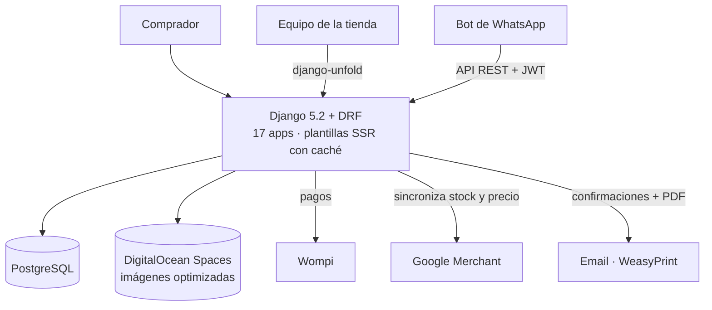
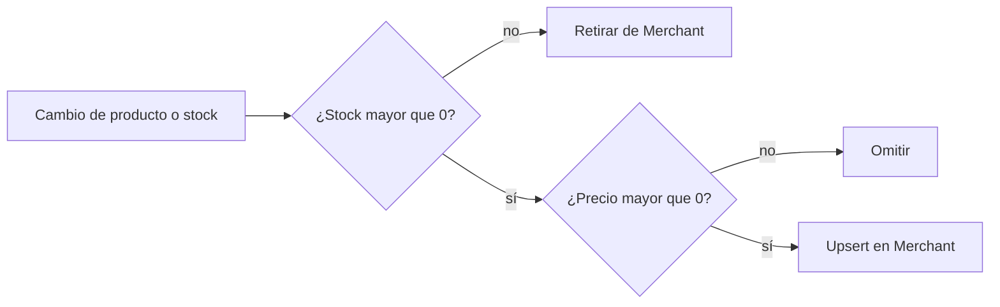
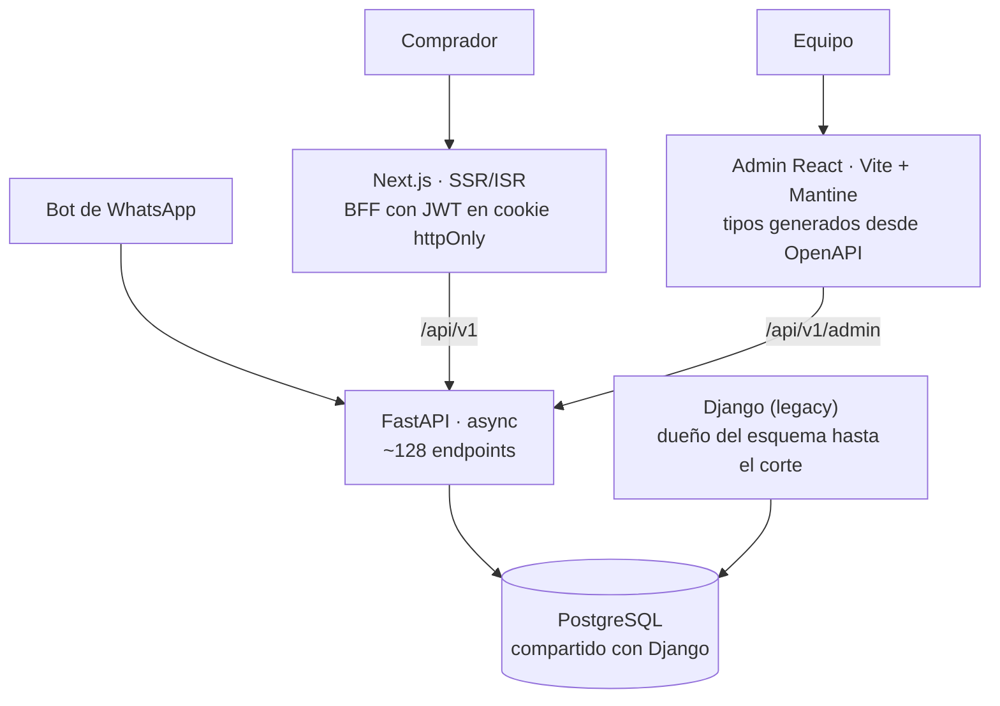
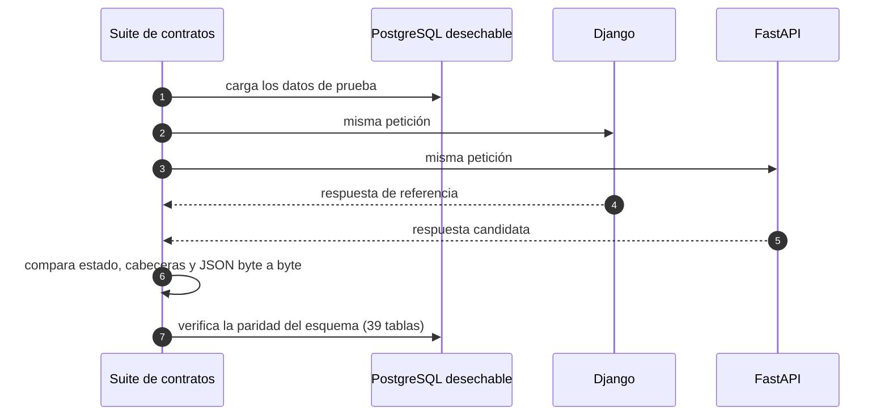

[Zona Repuestera](https://zonarepuestera.com.co) es una tienda online de autopartes en Colombia que funciona sobre un monolito Django. Como trabajo **independiente**, en paralelo a mi puesto principal, estoy liderando su reescritura a una arquitectura moderna **sin detener la venta**: un backend en FastAPI, un storefront en Next.js y un panel de administración en React.

La tienda la usan tres tipos de cliente: los compradores (como invitados o registrados, con OTP o Google), el equipo de la tienda desde el panel de administración y un **bot de WhatsApp** que consulta pedidos, catálogo y recomendaciones a través de la API.

## Punto de partida: el monolito en producción

El sistema actual resuelve todo el negocio, y la reescritura tiene que conservarlo sin romper nada:

- **Búsqueda por compatibilidad de vehículo**: cada producto se relaciona con los modelos de vehículo compatibles (marca → modelo), y eso guía la navegación y las recomendaciones.
- **Catálogo operable por la tienda**: importación masiva desde Excel y ZIP de imágenes, alias de categorías y productos para mejorar la búsqueda, precios de inventario y ubicación física en bodega.
- **Pedidos completos**: carrito anónimo o de usuario, facturación a persona o empresa, envío por transportadora o recogida en tienda, historial de estados, PDF del pedido y auditoría.
- **Imágenes optimizadas al subirlas** (HEIF, mozjpeg) y páginas SSR con caché de una hora que se invalida al cambiar productos o categorías.

## Google Merchant dirigido por el stock

El catálogo de Google Shopping se mantiene sincronizado automáticamente, así que no se anuncian productos agotados ni sin precio.

## La reescritura: strangler fig verificado por contratos

El monolito cumplió su función, pero para crecer necesitaba una API más rápida y tipada, un storefront con SSR/ISR y un panel de administración propio. En lugar de reescribirlo todo y cambiar de golpe, apliqué el patrón **strangler fig**: el sistema nuevo convive con el antiguo sobre **la misma base de datos** y reemplaza sus rutas de forma gradual.

- **Compatibilidad total durante la transición**: los JWT son compatibles con SimpleJWT, así que la sesión funciona en ambos sistemas; los *presenters* devuelven exactamente la forma JSON de DRF, y las URLs públicas quedan congeladas para no perder SEO ni el feed de Merchant.
- **Efectos secundarios explícitos**: las señales implícitas de Django (email, PDF, Merchant, imágenes, contadores) se convierten en hooks y eventos declarados en el código.
- **Panel de administración genérico**: 29 recursos se describen desde un endpoint `/meta/`, y el frontend genera sus tipos desde el esquema OpenAPI.

## Cómo se garantiza que nada se rompa

- **1.445 tests de contrato** ejecutan cada petición contra los dos sistemas sobre la misma base de datos y exigen respuestas idénticas.
- El mapeo de SQLAlchemy **se genera desde los modelos de Django**, así que el esquema no puede divergir mientras Django sea su dueño.
- Los contratos del bot de WhatsApp están **congelados**, incluidas algunas rarezas del sistema antiguo que se replican a propósito.
- Durante la reescritura hice además una revisión de seguridad y **corregí problemas en la verificación de pagos, la autorización de recursos, el login social y la generación de códigos OTP**, cada uno cubierto por tests.

## Calidad

- En el stack nuevo: tests async con pytest; 52 unitarios y 15 e2e en el storefront; 46 unitarios y 12 e2e en el panel.
- **GitHub Actions** con lint, tipos, tests, `pip-audit`, `npm audit` y `knip`, con las acciones fijadas por SHA. Los despliegues quedan fuera del CI a propósito hasta el corte.
- Workspace preparado para **desarrollo asistido por IA**, con `AGENTS.md` y `CLAUDE.md` que describen los contratos y las reglas de cada repositorio.
